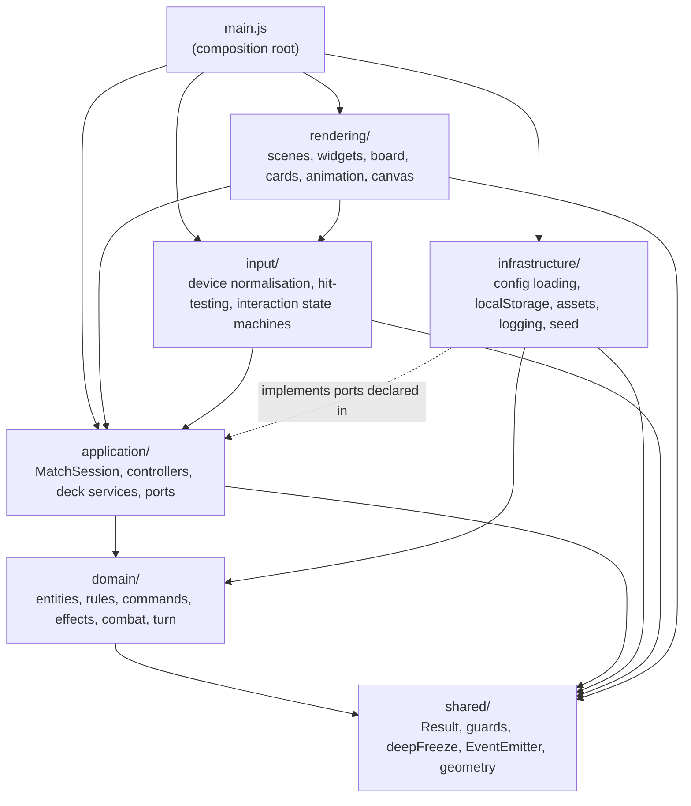
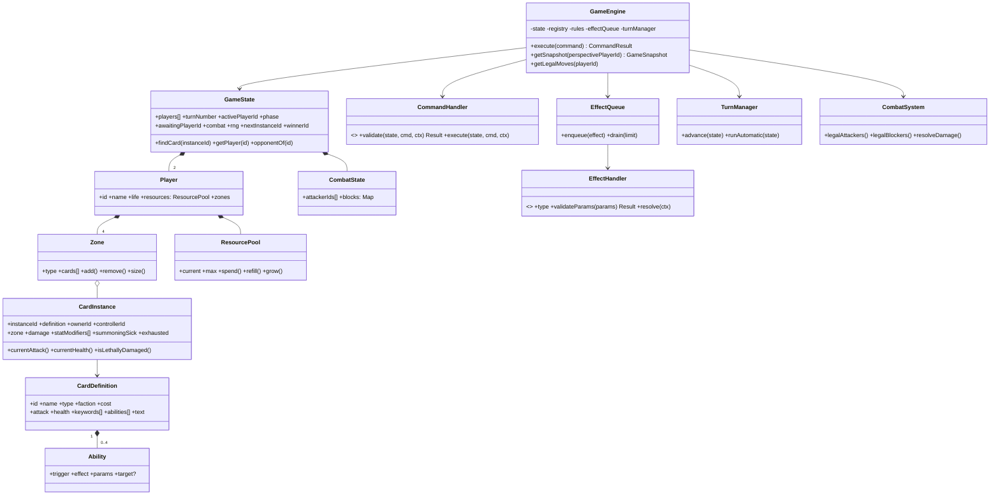
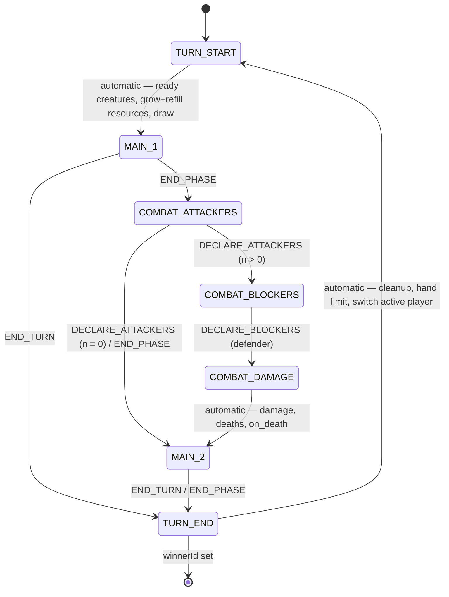
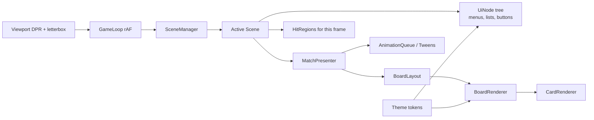
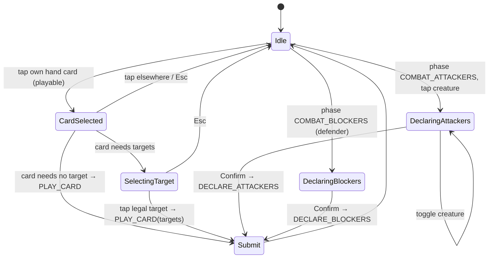

# Canvas Card Game Engine — Requirements Analysis & Architecture Proposal

**Status:** Architecture accepted 2026-09-21. Implementation in progress — see §3 for the increment log.
**Date:** 2026-09-21

---

## Part 1 — Requirements and architectural analysis

### 1.1 What the vertical slice must prove

The first playable build is not "a small game"; it is a proof that the engine's boundaries hold under a real feature set. It must demonstrate, end to end:

| Capability | Proves |
|---|---|
| Menu → deck selection → match → game over → menu | Scene management, navigation, session lifecycle |
| Preconstructed decks + custom deck builder with save/load | Data-driven content, validation of untrusted data, persistence port |
| Play creatures and spells, attack, block, resolve damage | Command pipeline, turn/phase machine, combat rules |
| Triggered abilities (`on_play`, `on_death`) and targeted effects | Effect registry, trigger dispatch, targeting, bounded resolution |
| A non-human opponent (basic AI) | Commands are the only way into the engine, for any player source |
| Headless test suite for the domain (Node, no DOM) | Domain has zero rendering/browser coupling |

### 1.2 Mechanics: in scope now vs. deferred

**Implemented in the slice**

- Two players, life totals (20), win by reducing opponent to 0.
- Zones: library, hand, battlefield, graveyard.
- Card types: `creature` (cost, attack, health) and `spell` (cost, immediate effect).
- Resource: an incrementing per-turn pool (see assumption A1).
- Turn structure: start (ready, gain resource, draw) → main 1 → combat (declare attackers → declare blockers → damage) → main 2 → end.
- Summoning sickness, exhaustion after attacking.
- Effects: `draw_card`, `deal_damage`, `heal`, `modify_stats`; triggers `on_play`/`on_cast`, `on_death`; declarative targeting.
- State-based actions: lethal damage → graveyard, life ≤ 0 → loss, empty library → fatigue damage.
- Deck rules: min/max size, max copies, allowed types, faction rule (`any`: the faction is the deck's theme and every card may go in — the shipped setting; `single_plus_neutral`: one faction plus the shared pool).

**Deferred (architecturally anticipated — see 2.14)**

- Priority / instant-speed responses / stack resolution.
- Land-style resource cards, multi-colour costs.
- Additional permanent types (artifacts, enchantments), counters, auras, static abilities, replacement effects.
- Keywords beyond `haste` (which the slice may include if cheap).
- Mulligan, sideboards, multiple game modes, multiplayer, replay UI.

### 1.3 Ambiguities, assumptions and their architectural impact

| # | Ambiguity | Assumption taken | Impact if the assumption is reversed |
|---|---|---|---|
| A1 | **Resource model**: land cards (MTG) vs. auto-growing pool (Hearthstone). The brief says "MTG-inspired" but also lists "resource requirements" as a *deck* rule. | Auto-growing pool: +1 max per turn, cap 10, refilled at turn start. All costs are generic; faction affects deck building only. | `ResourceSystem` is a strategy behind a stable interface; land cards would add a `resource` card type, a `PLAY_RESOURCE` command and a board zone. Contained change (domain + one board zone). |
| A2 | **Opponent** for a single-canvas game. | A built-in rule-based AI (`BasicAiController`). Hot-seat is possible with the same `PlayerController` contract but hidden-information UX is not addressed in the slice. | None: both are `PlayerController` implementations. |
| A3 | **Blocking**: the brief says "attacking, defending". | Blockers are declared by the defending player; one blocker per attacker in the slice; the data model already allows several. | Removing blocking is a rules flag (`combat.blockersEnabled`). |
| A4 | **Effect timing**: stack vs. immediate. | No priority, no responses. Effects resolve immediately from a FIFO queue at the moment they are produced. | Adding a stack changes `EffectQueue` (LIFO + priority passes), adds a `PASS_PRIORITY` command and one extra phase state. Medium, but isolated: no renderer or input change beyond a "respond" prompt. |
| A5 | **Target devices** | Desktop-first, mouse; touch supported through pointer normalisation. Fixed logical resolution 1600×900, letterboxed and DPR-aware. | Layout constants live in one config; the input layer already abstracts pointers. |
| A6 | **Persistence scope** | Custom decks and settings only. No mid-match save in the slice. | Match save = serialising `(seed, initial deck lists, command log)`; the engine design already makes this possible. |
| A7 | **Tooling** | No bundler, no runtime dependencies. Node ≥ 20 (22 LTS recommended) for `node --test` and lcov coverage. ESLint as an *optional* dev dependency. A static file server is required to run ES modules + `fetch` of JSON. | None on architecture. |
| A8 | **Content size** | ~24–30 card definitions across 2 factions + neutral; 2 preconstructed decks. | None. |
| A9 | **Language / copy** | English. UI strings are centralised so localisation is a data change later. | None. |

Items A1–A4 are worth confirming before Increment 2 (domain engine) starts. Everything else can change later at low cost.

### 1.4 Minimum viable game loop

```
Main menu
  ├─ Play → Deck selection (precon or saved custom) → Match setup
  │     Match setup: validate both deck lists → seed RNG → shuffle → draw opening hands
  └─ Deck builder → build/edit → validate → save (localStorage) → back

Match loop (per turn, active player P):
  TURN_START   (automatic) ready all P's creatures, +1 max resource, refill, draw 1
  MAIN_1       P may PLAY_CARD (pay cost, resolve on_play/on_cast effects) or END_PHASE / END_TURN
  COMBAT       P: DECLARE_ATTACKERS (0..n untapped, non-sick creatures)
               if n > 0 → opponent: DECLARE_BLOCKERS → (automatic) damage, deaths, on_death
  MAIN_2       as MAIN_1
  TURN_END     (automatic) end-of-turn cleanup, hand-size limit, pass turn

After every command and every resolved effect: state-based actions run until stable.
Game over when a player's life ≤ 0 or on CONCEDE → game-over overlay → main menu.
```

### 1.5 Technical risks

| Risk | Mitigation |
|---|---|
| Renderer or input code obtains references to domain entities and mutates them. | The engine never hands out entities. It exposes **frozen plain-object snapshots** (`GameSnapshot`) filtered per player perspective. Nothing outside `domain/` can reach a `Player` or `CardInstance` object. |
| Effect system grows into a god module with a giant `switch`. | `EffectRegistry` maps effect type → handler object (`validateParams`, `resolve`). One file per effect. Adding an effect never touches the engine. |
| Trigger cascades (on_death → damage → on_death …) recurse without bound. | Effects are queued, never resolved recursively. Resolution loop has `limits.maxEffectsPerResolution`; exceeding it aborts the command and leaves the pre-command state (see "transactional execution" in 2.4). |
| Non-determinism leaks into the domain (`Math.random`, `Date.now`). | `RandomSource` injected; no clock in the domain. Instance ids come from a counter in `GameState`. Enforced by an architecture test that scans `domain/` for forbidden globals. |
| Canvas-only UI: scrolling lists, text entry (deck names), overlays. | Small retained-mode widget kit (`UiNode` tree) with hit-testing and clipping; `TextField` driven by `keydown` with a restricted character set and length cap. Deliberately not a general layout engine. |
| Hit-testing drifts from what is drawn during animations. | Hit regions are produced by the *layout* pass (target positions); animations are cosmetic. Interactions are disabled while a blocking animation plays. |
| DPR / resize / letterboxing bugs. | Single `Viewport` owns the logical→device transform; input converts device px → logical units in one place. |
| `localStorage` unavailable or full (private mode, quota). | Repository returns a `Result` failure; the app falls back to an in-memory store and surfaces a warning. Payload size cap before write. |
| Static-analysis hot spots: command validation, draw code, phase logic. | Table-driven phase machine; one handler per command; layout constants in config; guard-clause style; no nested ternaries. |
| Hidden information in the AI. | The AI only receives `snapshot.forPlayer(aiId)`, same as a human would. Prevents a "cheating AI" by construction and matches the future server-authoritative model. |

### 1.6 Security boundaries (client-side)

Everything that crosses the boundary below is untrusted and goes through a validator that produces domain objects or a typed error — never a raw parsed object:

```
  cards/*.json ─┐
  decks/*.json ─┤
  rules/*.json ─┼─► validators (domain/…/validate*.js, pure) ─► typed domain objects
  localStorage ─┤
  UI / input   ─┴─► GameCommand (plain data) ─► CommandHandler.validate ─► execute
```

**What a client-side design can guarantee**

- Integrity against *accidental* corruption and against malformed/malicious *data files* (schema, bounds, prototype-pollution-safe parsing).
- Rule enforcement for every action that enters through the command pipeline: an invalid command cannot alter state.
- Deterministic, replayable matches (seed + command log).
- No code execution from data (no `eval`, `new Function`, no dynamic `import()` of data-supplied paths).

**What it cannot guarantee**

- A player with DevTools can call engine methods or edit memory. Anti-cheat, fair matchmaking and authoritative results require a server that owns the `GameEngine` and receives only commands; the client would then apply the same engine optimistically and reconcile. The proposed design (commands as plain data, perspective-filtered snapshots, seeded RNG) is exactly what makes that migration mechanical rather than a rewrite.

### 1.7 Anticipated static-analysis (SonarQube) hot spots

| Rule | Where it would bite | Design answer |
|---|---|---|
| S3776 Cognitive complexity | Command validators, phase transitions, board drawing | Guard clauses; table-driven phases; one handler per command/effect; renderer split per zone |
| S1192 Duplicated string literals | Command types, phases, zone names, event names | `const` enum modules (`Object.freeze`) |
| S109 Magic numbers | Layout, colours, timing | `theme.json` + `layout` constants module |
| S2245 Pseudorandom number generators | Seeded PRNG | Documented as non-security use; seed from `crypto.getRandomValues` in infrastructure |
| S106 `console.*` | Diagnostics | `Logger` with injected sink |
| S2486 / S1186 Empty catch / empty function | Storage access, optional hooks | Always return a `Result` or log |
| S4144 / S1871 Duplicated functions/branches | Scenes, widgets | Shared `Scene` and `UiNode` bases; composition |
| S107 Too many parameters | Renderers | Options objects |
| S3358 Nested ternaries, S1066 collapsible ifs | Everywhere | Style rule; ESLint mirrors it |
| Coverage | Domain + application | `node --test` with `--experimental-test-coverage --test-reporter=lcov` |

---

## Part 2 — Architecture proposal

### 2.1 Layers and dependency direction



Rules (enforced by `test/architecture/dependencyRules.test.js`, a small import-graph checker with no dependencies):

1. `domain/` imports only `shared/`. No `window`, `document`, `fetch`, `localStorage`, `Math.random`, `Date`.
2. `application/` imports `domain/` and `shared/`. It declares *ports* (contracts) such as `DeckRepository`, `Scheduler`; it never imports `infrastructure/`, `rendering/` or `input/`.
3. `infrastructure/` implements ports and calls domain validators. It never imports `rendering/` or `input/`.
4. `input/` maps device events to logical events and to application commands. It never imports `rendering/`.
5. `rendering/` reads snapshots and application read-models, owns presentation state, and delegates interaction to `input/` controllers. It never imports `domain/` entities — only the constant modules (`GamePhase`, `ZoneType`, …), which are frozen data.
6. `main.js` is the only module allowed to import everything: it constructs and wires instances (manual dependency injection).

**Interfaces in JavaScript.** Contracts are expressed as JSDoc `@typedef`/`@interface` blocks in `*.contract.js` files (documentation + editor type-checking via `// @ts-check`, no build step) and enforced at wiring time by `assertImplements(obj, ["method", …])` in `shared/guards.js`. This gives Dependency Inversion without a framework.

### 2.2 Directory structure

```
magic8/
├── index.html                      hosts <canvas id="game">, loads src/main.js as a module
├── package.json                    scripts only (serve, test, lint); zero runtime deps
├── sonar-project.properties
├── eslint.config.js                optional; mirrors Sonar rules
├── docs/
│   └── ARCHITECTURE.md
├── data/                           untrusted, validated on load
│   ├── cards/core.cards.json
│   ├── decks/precon_ember.deck.json
│   ├── decks/precon_iron.deck.json
│   ├── rules/game-rules.json
│   ├── rules/deck-rules.json
│   └── ui/theme.json
├── src/
│   ├── main.js
│   ├── shared/
│   │   ├── Result.js               ok(value) | fail(code, message, details)
│   │   ├── guards.js               isPlainObject, isSafeKey, assertImplements, clampInt …
│   │   ├── deepFreeze.js
│   │   ├── EventEmitter.js         typed, bounded listener lists
│   │   ├── geometry.js             Rect, containsPoint
│   │   └── constants.js            LIMITS shared by validators (max string lengths, etc.)
│   ├── domain/
│   │   ├── cards/
│   │   │   ├── CardType.js         frozen enum
│   │   │   ├── CardDefinition.js   immutable value object
│   │   │   ├── CardInstance.js     runtime entity (id, definition, owner, zone, damage, buffs, flags)
│   │   │   ├── CardCatalog.js      id → CardDefinition, read-only after load
│   │   │   └── validateCardDefinition.js
│   │   ├── decks/
│   │   │   ├── DeckList.js         value object: id, name, faction, entries[{cardId,count}]
│   │   │   ├── DeckRules.js        parsed/validated deck rules config
│   │   │   ├── DeckValidator.js    DeckList × DeckRules × CardCatalog → ValidationReport
│   │   │   └── validateDeckList.js
│   │   ├── game/
│   │   │   ├── GameRules.js        parsed/validated game rules config
│   │   │   ├── GamePhase.js, ZoneType.js, GameEventType.js   frozen enums
│   │   │   ├── Zone.js             ordered, bounded card collection
│   │   │   ├── Player.js
│   │   │   ├── GameState.js        aggregate root; owns players, turn, phase, combat, id counter, rng state
│   │   │   ├── GameEngine.js       execute(command) → CommandResult; getSnapshot(perspective)
│   │   │   ├── StateBasedActions.js
│   │   │   ├── LegalMoves.js       query: legal commands for a player (used by UI highlight + AI)
│   │   │   └── GameSnapshot.js     projection + perspective filter + deepFreeze
│   │   ├── commands/
│   │   │   ├── CommandType.js      frozen enum
│   │   │   ├── commandFactories.js playCard(...), declareAttackers(...) → plain objects
│   │   │   ├── validateCommandShape.js   structural validation of untrusted command objects
│   │   │   ├── CommandRegistry.js  type → handler
│   │   │   └── handlers/
│   │   │       ├── PlayCardHandler.js
│   │   │       ├── DeclareAttackersHandler.js
│   │   │       ├── DeclareBlockersHandler.js
│   │   │       ├── EndPhaseHandler.js       (END_PHASE and END_TURN)
│   │   │       └── ConcedeHandler.js
│   │   ├── turn/
│   │   │   ├── PhaseTable.js       declarative transitions + which commands are legal per phase
│   │   │   └── TurnManager.js      advance(), runAutomaticPhases()
│   │   ├── combat/
│   │   │   ├── CombatState.js      attackers, blocks (attackerId → blockerIds[])
│   │   │   └── CombatSystem.js     legality queries + damage resolution → events
│   │   ├── resources/
│   │   │   ├── ResourcePool.js
│   │   │   ├── ResourceSystem.contract.js
│   │   │   └── IncrementalResourceSystem.js   (strategy)
│   │   ├── effects/
│   │   │   ├── EffectRegistry.js
│   │   │   ├── EffectQueue.js      FIFO now; designed to become a stack
│   │   │   ├── EffectContext.js    state, source card, controller, targets, rng, emit()
│   │   │   ├── TargetSpec.js       declarative target descriptor + validation
│   │   │   ├── TargetResolver.js   checks chosen target ids against a TargetSpec
│   │   │   ├── TriggerDispatcher.js collects abilities whose trigger matches an event
│   │   │   ├── handlers/
│   │   │   │   ├── DrawCardEffect.js
│   │   │   │   ├── DealDamageEffect.js
│   │   │   │   ├── HealEffect.js
│   │   │   │   └── ModifyStatsEffect.js
│   │   │   └── registerCoreEffects.js   the explicit "content" extension point
│   │   └── random/
│   │       ├── RandomSource.contract.js
│   │       └── SeededRandom.js     mulberry32; state is serialisable
│   ├── application/
│   │   ├── AppContext.js           holds wired services; passed to scenes
│   │   ├── ports/
│   │   │   ├── DeckRepository.contract.js
│   │   │   ├── ContentSource.contract.js   loadCards(), loadDecks(), loadRules()
│   │   │   └── Scheduler.contract.js       delay(ms) — keeps timers out of domain
│   │   ├── match/
│   │   │   ├── MatchSetupService.js  deck lists → validated → GameState + engine
│   │   │   ├── MatchSession.js       owns engine + controllers; submit(command); events
│   │   │   ├── PlayerController.contract.js
│   │   │   ├── HumanController.js
│   │   │   └── BasicAiController.js
│   │   └── decks/
│   │       ├── DeckBuildingService.js  add/remove/rename/validate/save/load (no rendering)
│   │       └── DeckSelectionService.js precon + saved decks as read-models
│   ├── infrastructure/
│   │   ├── config/JsonContentSource.js     fetch + validate → domain objects
│   │   ├── persistence/
│   │   │   ├── KeyValueStore.contract.js
│   │   │   ├── LocalStorageStore.js, InMemoryStore.js
│   │   │   ├── StorageEnvelope.js          version + validation + size cap
│   │   │   └── StoredDeckRepository.js     implements DeckRepository over KeyValueStore
│   │   ├── assets/AssetLoader.js           images/fonts (slice draws procedurally)
│   │   ├── logging/Logger.js
│   │   ├── time/BrowserScheduler.js
│   │   └── random/seedProvider.js          crypto.getRandomValues → seed
│   ├── input/
│   │   ├── InputManager.js         addEventListener on canvas; pointer/touch/mouse/keyboard
│   │   ├── PointerNormalizer.js    device px → logical units via Viewport transform
│   │   ├── KeyMap.js
│   │   └── interaction/
│   │       └── MatchInteraction.js state machine: Idle → CardSelected → SelectingTarget → …
│   │                               (a DeckBuilderInteraction was planned; the builder turned out to be
│   │                                plain widget activations, so it lives in rendering/scenes/deckBuilder/)
│   └── rendering/
│       ├── canvas/
│       │   ├── CanvasHost.js       canvas element, DPR, resize
│       │   ├── Viewport.js         logical 1600×900 ↔ device transform
│       │   └── GameLoop.js         requestAnimationFrame, fixed-dt update
│       ├── scenes/
│       │   ├── Scene.js            enter/exit/update/render/onPointer/onKey
│       │   ├── SceneManager.js
│       │   ├── MainMenuScene.js
│       │   ├── DeckSelectionScene.js
│       │   ├── DeckBuilderScene.js
│       │   ├── deckBuilder/        LibraryView, EditorView, modals, layout
│       │   └── MatchScene.js
│       ├── ui/                     UiNode, Button, Label, Panel, ScrollList, TextField, TextBlock, Modal, ConfirmModal
│       ├── cards/CardDetail.js, CardRenderer.js, CardVisual.js
│       ├── board/BoardLayout.js, MatchPresenter.js, BoardNode.js, CardNode.js, PlayerNode.js, EffectsNode.js, eventLog.js
│       ├── animation/Tween.js      (Easing lives in Tween.js; no separate AnimationQueue was needed)
│       ├── text/textUtils.js       wrapping, ellipsis, measuring cache
│       └── theme/Theme.js          validated theme.json → frozen tokens
└── test/
    ├── domain/…                    the bulk of tests; runs headless
    ├── application/…
    ├── infrastructure/…            InMemoryStore, envelope validation
    └── architecture/dependencyRules.test.js
```

### 2.3 Core domain model



Design notes:

- `CardDefinition` is immutable and shared; `CardInstance` holds only per-instance runtime state and derives current stats from definition + modifiers. This keeps buffs, damage and future counters out of the definition.
- `GameState` is the single aggregate root. It is only ever mutated inside `GameEngine.execute`. Entities expose queries publicly; their mutation methods are reachable only from `domain/` because entities are never exported past the snapshot boundary.
- `ownerId` vs `controllerId` are separate from day one (cheap; prevents a painful migration for steal effects).
- `CombatState` stores `blocks` as `attackerId → blockerIds[]` even though the slice allows one blocker — the data shape is the expensive thing to change; the rule is a one-line check.

### 2.4 State mutation and the command pipeline

**Principle:** the only way to change `GameState` is `GameEngine.execute(command)` where `command` is a plain, serialisable object.

```js
// illustrative command shapes (plain data, no methods)
{ type: "PLAY_CARD",         playerId: "p1", cardId: "c17", targets: ["c03"] }
{ type: "DECLARE_ATTACKERS", playerId: "p1", attackerIds: ["c05", "c09"] }
{ type: "DECLARE_BLOCKERS",  playerId: "p2", blocks: [{ attackerId: "c05", blockerId: "c21" }] }
{ type: "END_PHASE",         playerId: "p1" }
{ type: "END_TURN",          playerId: "p1" }
{ type: "CONCEDE",           playerId: "p1" }
```

```mermaid
sequenceDiagram
  participant IM as InputManager
  participant MS as MatchScene
  participant MI as MatchInteraction
  participant S as MatchSession
  participant E as GameEngine
  participant H as PlayCardHandler
  participant Q as EffectQueue
  participant SBA as StateBasedActions

  IM->>MS: pointer(logical x,y)
  MS->>MI: hit(card c17)  [Idle → CardSelected]
  IM->>MS: pointer(logical x,y)
  MS->>MI: hit(creature c03)  [SelectingTarget → submit]
  MI->>S: submit(PLAY_CARD c17 → c03)
  S->>E: execute(command)
  E->>E: validateCommandShape (structural, untrusted input)
  E->>E: phase/actor legality (PhaseTable)
  E->>H: validate(state, cmd)   cost, zone, target spec
  H-->>E: ok
  E->>H: execute(state, cmd, ctx)   move card, pay cost, emit CardPlayed
  H->>Q: enqueue(on_play / on_cast effects with resolved targets)
  E->>Q: drain(limit)           each effect emits events; triggers enqueue more
  E->>SBA: run()                deaths → on_death → drain again (bounded)
  E->>E: TurnManager.runAutomatic()   advance through decision-free phases
  E-->>S: { ok, events[], version }
  S-->>MS: events + engine.getSnapshot("p1")   (frozen plain data)
  MS->>MS: MatchPresenter animates, BoardLayout recomputes
```

Key decisions and trade-offs:

| Decision | Why | Trade-off |
|---|---|---|
| **Controlled mutation inside the engine** rather than immutable reducers returning new state | Natural OOP entities, no structural-sharing library, simpler handlers | Must guarantee no entity leaks; solved by the snapshot boundary |
| **Transactional execution**: the engine clones state (`GameState.clone()`, cheap at this size) before executing; on validation failure, thrown error, or resolution-limit breach, the clone is discarded | An invalid or exploding command can never leave a half-applied state | One deep clone per command (hundreds of small objects) — negligible for a card game; revisit only if profiling says so |
| **Snapshot projection** (`GameSnapshot`): plain objects, `deepFreeze`d, perspective-filtered (opponent hand → count only, libraries → count only) | Rendering is structurally read-only; AI cannot cheat; same shape a server would send | Snapshot rebuilt after each command; renderer diffs by id for animations (it does, via events) |
| **Events** (`CardPlayed`, `DamageDealt`, `CreatureDied`, `PhaseChanged`, `TurnStarted`, `GameEnded` …) appended to a bounded per-command list and returned | Drives animations, logs, and future replay/network without the renderer inspecting state deltas | Event vocabulary must be kept small and stable |
| **Determinism**: seeded RNG in state, counter-based ids, no clock, automatic phases run synchronously inside `execute` | Replay = `(seed, decks, commands[])`; undo = replay to N; tests are exact | Presentation must add its own pacing (AI "thinking" delay lives in `MatchSession` via the `Scheduler` port) |
| **`LegalMoves` query** in the domain | UI highlighting and AI use the same legality source as validation → no drift | Slight duplication with handler `validate`; mitigated by handlers delegating to the same predicates |

**Justified exception to "no presentation state":** scenes own *presentation* state (selection, hover, tween positions, animation queue). This is not game state and never flows back into the domain except as a command.

### 2.5 Turn and phase state machine



`PhaseTable` is data:

```js
// illustrative
{
  MAIN_1:           { actor: "active",   automatic: false, allows: ["PLAY_CARD", "END_PHASE", "END_TURN", "CONCEDE"], next: "COMBAT_ATTACKERS" },
  COMBAT_ATTACKERS: { actor: "active",   automatic: false, allows: ["DECLARE_ATTACKERS", "END_PHASE", "CONCEDE"], next: "COMBAT_BLOCKERS" },
  COMBAT_BLOCKERS:  { actor: "defender", automatic: false, allows: ["DECLARE_BLOCKERS", "CONCEDE"], next: "COMBAT_DAMAGE" },
  COMBAT_DAMAGE:    { actor: null,       automatic: true,  allows: [], next: "MAIN_2" },
  // …
}
```

`awaitingPlayerId` is derived from `actor`; `MatchSession` uses it to decide which `PlayerController` to poll. A future priority system adds `actor: "priority"` and a `PASS_PRIORITY` command without restructuring the table.

### 2.6 Effect system and the limits of data-driven design

**Vocabulary (fixed in code, combined in data):** `draw_card`, `deal_damage`, `heal`, `modify_stats`, since the Shadow content drop `drain` (damage that heals the controller), `discard` (a player discards at random, seeded) and `sacrifice` (a creature goes to the graveyard through the ordinary death pipeline), and since the Arcane content drop `return_to_hand` (a creature leaves the battlefield for its owner's hand), `mill` (a player's top library cards go to their graveyard) and `destroy` (a creature dies through the same pipeline as a sacrifice).

| Concept | Data expresses | Validated by |
|---|---|---|
| Trigger | `on_play`, `on_cast`, `on_death` (slice), `on_turn_start` (Arcane drop: fires for the active player's creatures after the start-of-turn draw, automatic targets only); later `on_attack`, `on_damage_dealt` | `TriggerDispatcher` enum |
| Effect | `{ "effect": "deal_damage", "params": { "amount": 3 } }` | `EffectRegistry.get(type).validateParams(params)` at catalog load |
| Target | `{ "kind": "creature" \| "player" \| "creature_or_player", "owner": "any" \| "enemy" \| "ally", "count": 1 }` | `TargetSpec` at load; `TargetResolver` at command time |
| Condition (later) | small closed set: `{ "type": "controls_min_creatures", "value": 3 }` | per-condition validator |
| Keyword | `["haste"]` | closed enum |

**What data can do:** any combination of the above, new cards, new decks, balance changes, new preconstructed decks, rules tuning.

**What data cannot do — and must not try to:** new primitives (e.g. "copy", "counter"), replacement effects ("instead of dying…"), static/continuous effects ("other creatures get +1/+1"), conditional logic beyond the closed condition set, anything requiring iteration or arithmetic over state. These require a new `EffectHandler` (one small class with `validateParams` + `resolve`) registered in `registerCoreEffects.js`. The temptation to add a mini expression language (`"amount": "controlledCreatures * 2"`) is explicitly rejected: it recreates `eval` with a worse parser and a worse security story.

**Resolution model (slice):** `EffectQueue` is FIFO. A handler's `resolve(ctx)` mutates state through entity methods, emits events, and may enqueue follow-ups; it never resolves other effects itself. `drain(limit)` processes until empty or `limits.maxEffectsPerResolution`, at which point the whole command fails transactionally. Evolution to a stack: change `drain` order to LIFO, add a `PASS_PRIORITY` command that drains one item, and add a "responding" actor to the phase table.

### 2.7 Data schemas

All schemas carry `schemaVersion`. All validators: reject non-plain objects, reject keys `__proto__`/`constructor`/`prototype`, enforce types, ranges and string length caps, reject unknown effect/trigger/target/keyword values, and return a `Result` with a path-qualified error (`cards[3].abilities[0].params.amount: expected integer 1..99`).

**Card definitions** — `data/cards/*.cards.json`

```json
{
  "schemaVersion": 1,
  "cards": [
    {
      "id": "iron_watcher",
      "name": "Iron Watcher",
      "type": "creature",
      "faction": "iron",
      "cost": 3,
      "attack": 2,
      "health": 4,
      "keywords": [],
      "abilities": [
        { "trigger": "on_play", "effect": "draw_card", "params": { "amount": 1 } }
      ],
      "text": "When Iron Watcher enters the battlefield, draw a card."
    },
    {
      "id": "ember_bolt",
      "name": "Ember Bolt",
      "type": "spell",
      "faction": "ember",
      "cost": 2,
      "abilities": [
        {
          "trigger": "on_cast",
          "effect": "deal_damage",
          "params": { "amount": 3 },
          "target": { "kind": "creature_or_player", "owner": "any", "count": 1 }
        }
      ],
      "text": "Deal 3 damage to any target."
    }
  ]
}
```

Constraints: `id` matches `^[a-z0-9_]{1,40}$` and is unique; `name` ≤ 40 chars; `text` ≤ 200; `cost` 0–20; `attack` 0–99; `health` 1–99; `abilities` ≤ 4; `faction` ∈ configured factions; creature fields required iff `type === "creature"`.

**Deck list** — `data/decks/*.deck.json`; persisted custom decks share the shape

```json
{
  "schemaVersion": 1,
  "id": "precon_iron",
  "name": "Iron Legion",
  "faction": "iron",
  "preconstructed": true,
  "cards": [ { "cardId": "iron_watcher", "count": 3 } ]
}
```

**Game rules** — `data/rules/game-rules.json`

```json
{
  "schemaVersion": 1,
  "startingLife": 20,
  "startingHandSize": 5,
  "cardsDrawnPerTurn": 1,
  "firstPlayerSkipsFirstDraw": true,
  "maxHandSize": 10,
  "maxBattlefieldCreatures": 7,
  "resource": { "type": "incremental", "gainPerTurn": 1, "max": 10, "startingMax": 0 },
  "combat": { "blockersEnabled": true, "summoningSickness": true, "maxBlockersPerAttacker": 1 },
  "emptyLibrary": { "mode": "fatigue", "damagePerDraw": 1 },
  "limits": { "maxEffectsPerResolution": 200, "maxEventsPerCommand": 500 }
}
```

**Deck rules** — `data/rules/deck-rules.json`

```json
{
  "schemaVersion": 1,
  "minSize": 30,
  "maxSize": 40,
  "maxCopies": 3,
  "allowedTypes": ["creature", "spell"],
  "factions": ["ember", "iron", "shadow", "neutral"],
  "factionRule": { "mode": "any", "neutral": "neutral" },
  "maxSavedDecks": 50,
  "deckNameMaxLength": 30
}
```

`factionRule.mode` is `any` (no card restriction; `neutral`, optional, only names the shared pool so it is not offered as a faction to start a deck from) or `single_plus_neutral` (cards must belong to the deck's faction or to the required `neutral` pool). `DeckRules.restrictsCards` tells the views which wording to use; they never compare the mode themselves.

**Storage envelope** — `localStorage["ccg.v1.decks"]`

```json
{ "schemaVersion": 1, "savedAt": "2026-09-21T10:00:00.000Z", "decks": [] }
```

Load policy: envelope invalid → discard with a logged warning (never crash). Individual deck invalid (e.g. unknown card id after a content change) → keep it, flag it `invalid` with reasons in the deck-selection read-model, refuse to start a match with it. Size cap 256 KB before write.

### 2.8 Rendering architecture



- **One canvas, one loop.** `GameLoop` calls `scene.update(dt)` then `scene.render(ctx)`; the loop skips redraws when the scene reports nothing dirty — a card game does not need 60 fps redraws while waiting for input.
- **Scenes** (`MainMenu`, `DeckSelection`, `DeckBuilder`, `Match`) share a `Scene` base with `enter(params)/exit()/update/render/onPointer/onKey`. `SceneManager.navigate(id, params)` is the only navigation API; scenes never construct each other.
- **Widget kit** (`UiNode` tree): bounds in logical units, children, `visible/enabled`, `draw(ctx)`, `hitTest(point)`, clipping for `ScrollList`. Small by design; it is not a layout engine — positions come from explicit layout helpers per scene.
- **Match presentation:** `BoardLayout` derives rectangles for zones and card slots from the snapshot (hand size, battlefield count) and the logical viewport. `CardVisual` objects (keyed by instance id) hold *presentation* position/scale/alpha and tween toward layout targets. `MatchPresenter` consumes engine events to enqueue animations (`CardPlayed` → hand→battlefield tween, `DamageDealt` → floating number, `CreatureDied` → fade). Interaction is blocked while a *blocking* animation runs; hit regions come from layout targets, not tweened positions.
- **Card rendering** is fully procedural (no image assets, no glyph shortcuts). `cards/CardFace.js` is the single painter of a card's face at any size: a proportional layout (`cardFaceLayout`, pure and tested) and a *profile* (`COMPACT` for the board, `FULL` for inspect) choosing type sizes and the art/text split. It composes `cards/CardArt.js` (faction motif painters in a strategy table — fire, steel, wilderness — plus a type emblem, every variable choice seeded by `hashString(definitionId)` so a card always looks the same) and `cards/statGem.js` (cost, attack and health gems with drawn sword/shield pictograms). `CardRenderer.drawCard` adds the interaction ring and the base-130×182 scale transform for the board; `CardDetail` adds a halo for the inspect views; `CardStrip` is the one-line list form used by the deck builder. Adding image art later means one branch in `CardArt` (draw the image instead of the motif) and nothing else.
- **Drawing primitives** live in `ui/drawing.js` (rounded rects, gradients, glows, bevels, inset shadows, outlined text) and `ui/shapes.js` (polygons, stars, gems, orbs, arrows, pictograms); `ui/backdrop.js` draws the shared scene background (radial glow, vignette, seeded motes). Decorative widgets (`OptionRow`, `Ornament`, `HeroNode`) are `UiNode`s like everything else. Every painter balances `save`/`restore` and the test fake keeps a real state stack to prove it.
- **Theme** (`theme.json`, schema 2, validated → frozen): colours (including a three-tone `{ base, light, dark }` per faction and stat/resource colours), a body face and a display face (`fontFor` picks the display face for title/heading sizes), spacing, animation durations. `theme/color.js` derives shades and translucent variants from tokens so the palette stays small. No draw code hardcodes a colour.
- **Read-only guarantee:** scenes hold `GameSnapshot` values and a `MatchSession` reference (for `submit` and read-models). They never receive `GameEngine` or `GameState`.

### 2.9 Input architecture

- `InputManager` attaches `pointerdown/move/up`, `wheel`, `keydown/keyup` with `addEventListener` on the canvas/window (no inline handlers), normalises mouse/touch/pen into a single logical `PointerInput { type, x, y, button }` via `Viewport.toLogical(clientX, clientY)`, and forwards to the `SceneManager`'s active scene. Touch: single-pointer tap/drag; long-press = inspect (card detail overlay).
- Board hit-testing reuses the widget tree: `BoardLayout` (pure) computes a slot per visible card and `MatchScene` builds one `CardNode`/`PlayerNode` per slot, so cards get the same press/release, hover and keyboard-focus behaviour as buttons. A separate `HitTester` over flat region lists was built in Increment 6 and removed in Increment 8 as dead code.
- **Interaction state machines** (in `input/interaction/`) translate hits into intent and then into commands:



  The state machine consults `LegalMoves` (via the snapshot's `legalMoves` section) to decide what is tappable — it never re-implements rules. Whatever it submits still goes through full engine validation; the UI is a convenience, not a guard.
- Keyboard: `Esc` cancel, `Enter`/`Space` confirm or end turn, arrows for menu focus (accessibility baseline), printable characters routed to a focused `TextField` only.

### 2.10 Persistence strategy

- Port: `DeckRepository { list(), get(id), save(deckList), remove(id) }` returning `Result`s. Implementation: `StoredDeckRepository` over a `KeyValueStore` port (`LocalStorageStore` in the browser, `InMemoryStore` for tests/fallback).
- Envelope with `schemaVersion`; a `migrations` map (`1 → 2 …`) is the hook for future changes; unknown versions are rejected.
- Everything read from storage is validated with the same `validateDeckList` used for bundled content; storage is not more trusted than a downloaded file.
- Custom deck ids are generated (`custom_<counter>` from the envelope, not random) and namespaced apart from precon ids.
- Not stored: card definitions (always from the catalog), match state (future: `(seed, deckIds, commands[])`).

### 2.11 Application layer

Kept intentionally thin — services with explicit methods rather than one class per use case, because the use cases are small and share state:

| Service | Responsibilities |
|---|---|
| `MatchSetupService` | `createMatch({ playerDecks, rules, catalog, seed })`: validates deck lists against rules, builds `GameState`, returns a `MatchSession`. |
| `MatchSession` | Owns the `GameEngine` and two `PlayerController`s. `submit(command)` → engine → publishes `{ events, snapshot }` via `EventEmitter`. After each command, if `awaitingPlayerId`'s controller is non-human, schedules `controller.decide(snapshotForPlayer, legalMoves)` through the `Scheduler` port and submits its command. This is also where a `RemoteController` would plug in for multiplayer. |
| `HumanController` / `BasicAiController` | Implement `PlayerController.decide(snapshot, legalMoves) → command \| null`. The AI is greedy: play highest-cost affordable card (targets: enemy creature with highest attack, else face), attack with everything that survives or trades up, block lethal. Enough to exercise every command type. |
| `DeckBuildingService` | Editing session over a `DeckList` draft: `addCard`, `removeCard`, `rename`, `report()` (validation via `DeckValidator`), `save()` via `DeckRepository`. No rendering knowledge — reusable by a future HTML or CLI tool. |
| `DeckSelectionService` | Read-model of precon + saved decks with validity flags. |
| `AppContext` | Bag of wired singletons (catalog, rules, services, logger, theme) handed to scenes. Built in `main.js`. |

### 2.12 Security design (concrete)

1. **Parsing:** `JSON.parse` only; results passed through `isPlainObject` checks; keys iterated with `Object.keys` + `Object.hasOwn`; forbidden keys rejected; validated objects are *rebuilt* field by field into domain objects (never spread or reused).
2. **Bounds everywhere:** deck size, hand size, battlefield size, ability count, string lengths, events per command, effects per resolution, saved decks count, storage payload size, listener counts.
3. **Commands:** `validateCommandShape` checks type ∈ enum, `playerId` ∈ state, all ids are strings ≤ 32 chars, arrays ≤ configured max, no extra keys. Then phase/actor legality, then handler semantics. Failures return `Result.fail(code)`; nothing throws to the caller for expected invalid input.
4. **No dynamic code:** effect/trigger/target types are looked up in `Map`s built from code; unknown → validation error at load.
5. **No DOM injection:** all text is drawn with `fillText` (no HTML). Text is still length-capped and control characters stripped at validation.
6. **Storage:** envelope validation, size cap, versioning; ids from storage are never used to index arrays.
7. **Determinism as integrity:** the command log + seed lets a future server re-execute and reject divergent clients.

### 2.13 Static-analysis posture

- ESLint (dev-only) with `eslint:recommended` + `no-eval`, `no-new-func`, `no-implied-eval`, `eqeqeq`, `no-param-reassign` (with props), `complexity` (≤ 12), `max-depth` (3), `max-params` (4), `no-nested-ternary`, `prefer-const`, `no-console`. Mirrors the Sonar rules listed in 1.7; `sonar-project.properties` points at `src/` with `test/` as tests and lcov coverage.
- Two intentional, documented Sonar findings are expected: S2245 (seeded PRNG, non-security) and possibly S1301 (`switch` with few cases) in enum guards. No `// NOSONAR` unless accompanied by a reason.
- No claim of a passing quality gate will be made without an actual analysis run.

### 2.14 Extension points and feature classification

| Feature | Status | Extension point |
|---|---|---|
| New cards / decks / balance | **Now (data only)** | `data/cards`, `data/decks` |
| New effect primitive | **Now (one handler class)** | `effects/handlers/*` + `registerCoreEffects` |
| New trigger type | **Supported** | `TriggerDispatcher` enum + emit in the relevant handler |
| New card type (artifact, enchantment) | **Supported** | `CardType` enum + validator branch + `PlayCardHandler` strategy per type + a board zone in `BoardLayout` |
| New faction / colour restrictions | **Now (data)** | `deck-rules.json` `factions`, `factionRule` |
| Land-style resources | **Supported** | `ResourceSystem` strategy + `PLAY_RESOURCE` command + zone |
| Status effects / counters | **Supported** | `CardInstance.statModifiers` already generalises to typed modifiers with durations |
| Stack / priority | **Supported (medium)** | `EffectQueue` order, `PASS_PRIORITY` command, `PhaseTable` actor `priority` |
| Static / continuous effects | **Requires evolution** | A layered stat-calculation pass (`currentAttack()` consulting active static effects) — `CardInstance` stat getters are designed as the single entry point now so this stays local |
| Replacement effects | **Requires evolution** | Interception hooks in `EffectContext.emit`; not designed now on purpose |
| AI opponent (basic) | **Now** | `PlayerController` |
| Stronger AI (search) | **Supported** | Engine cloning + `LegalMoves` make simulation possible; would need a headless `GameEngine.simulate` |
| Multiplayer (client-server) | **Supported** | Commands are plain data; snapshots are perspective-filtered; engine is deterministic; `RemoteController` + server-hosted engine |
| Replays / undo | **Supported** | `(seed, decks, commands[])`; undo = re-execute to N (no snapshot store needed initially) |
| Mid-match save | **Supported** | Serialise the same tuple |
| Additional game modes | **Supported** | Alternate `GameRules` + `PhaseTable`; scene per mode |
| Localisation | **Supported** | UI strings module; card text already data |
| Server-authoritative validation | **Requires evolution** | Move `GameEngine` execution server-side; client keeps the same engine for optimistic UI |

### 2.15 Prioritised implementation roadmap

Each increment ends with runnable tests and an explicit review (module boundaries, mutation audit, validation, Sonar hot spots, debt).

| # | Increment | Deliverables | Verification |
|---|---|---|---|
| 0 | **Scaffold** | `index.html`, `main.js` stub, `package.json` scripts, `shared/`, ESLint + Sonar config, architecture test skeleton | `npm test` runs; dependency-rule test passes on an empty tree |
| 1 | **Domain: content model** | `CardDefinition`, validators, `CardCatalog`, `DeckList`, `DeckRules`, `DeckValidator`, `GameRules`, `SeededRandom`, initial `core.cards.json` + precon decks | Validator tests incl. malicious inputs (proto keys, out-of-range, unknown effects); deck rule tests |
| 2 | **Domain: engine core** | `GameState`, `Zone`, `Player`, `ResourcePool`, `PhaseTable`, `TurnManager`, `CommandRegistry`, `EndPhase`/`EndTurn`/`Concede` handlers, `GameSnapshot`, `StateBasedActions`, fatigue, `LegalMoves` | Headless full-turn tests; determinism test (same seed + commands → identical snapshots) |
| 3 | **Domain: play & effects** | `PlayCardHandler`, `EffectRegistry`, 4 effect handlers, `TargetSpec`/`TargetResolver`, `TriggerDispatcher`, `EffectQueue`, transactional execution | Effect tests, trigger-chain bound test, invalid-target tests |
| 4 | **Domain: combat** | `CombatState`, `CombatSystem`, attacker/blocker handlers, summoning sickness | Combat matrix tests (blocked/unblocked/trades/lethal) |
| 5 | **Application + infrastructure** | `MatchSetupService`, `MatchSession`, controllers (human, basic AI), deck services, `JsonContentSource`, storage stack, `Logger`, `Scheduler` | AI-vs-AI headless match completes; repository round-trip tests with `InMemoryStore` |
| 6 | **Rendering/input foundation** | `CanvasHost`, `Viewport`, `GameLoop`, `Scene`/`SceneManager`, `InputManager`, `HitTester`, widget kit, `Theme`, `MainMenuScene` | Manual run in browser; hit-test and viewport unit tests |
| 7 | **Deck selection + deck builder scenes** | Both scenes, widget kit (`ScrollList`, `TextField`, `Modal`), card inspect overlay, save/load wired | Scene flow tests against real services; manual run |
| 8 | **Match scene** | `BoardLayout`, `CardRenderer`, `CardVisual`, `MatchPresenter`, `MatchInteraction`, board nodes, game-over overlay, minimal animations | Layout/interaction/presenter unit tests; scene flow tests vs real session + AI; manual run |
| 9 | **Hardening & polish** | Engine fuzzing, loop/global error surfaces, card inspect on the board (right-click / long-press / `I`), attack lunge, Play again, draft indicator, dead-code removal, docs | Fuzz + determinism tests; review pass on all boundaries; consolidated debt list |

Increments 1–5 are browser-free; the engine will be fully playable headlessly (AI vs AI) before a single pixel is drawn. That ordering is deliberate: it is the strongest possible test that rendering and rules are actually separated.

### 2.16 Decisions requested before implementation starts

1. **A1 Resource model** — proceed with the incrementing pool (recommended for the slice), or land cards from day one?
2. **A2 Opponent** — basic AI in the slice (recommended)?
3. **A3 Blocking** — include declare-blockers (recommended)?
4. **A4 No stack/priority in the slice** — acceptable?
5. **Tooling** — ESLint as a dev-only dependency: acceptable, or strictly zero `node_modules`?

**Resolved 2026-09-21:** all five recommended options accepted (incrementing pool, basic AI, blocking on, no stack in the slice, ESLint dev-only).


---

## Part 3 — Increment log

Each entry records what was built, the review performed, and known debt. Claims about static analysis refer to ESLint with the Sonar-aligned rule set (`npm run lint`); no SonarQube analysis has been executed yet.

### Increment 0 — Scaffold (done 2026-09-21)

**Built:** `index.html` (canvas host only), `src/main.js` stub, `package.json` (scripts only, zero runtime deps), `tools/dev-server.js` (dependency-free static server: no directory listing, path-traversal and null-byte guards, `GET`/`HEAD` only), `eslint.config.js`, `sonar-project.properties`, `src/shared/` (`Result`, `validation`, `limits`, `deepFreeze`), `test/architecture/dependencyRules.test.js`.

**Architecture test enforces:** relative imports only; the layer matrix of §2.1; presentation layers may import only enum/factory modules from `domain/`; no browser globals, clocks, timers, `Math.random` or `console` in `domain/` and `application/`; no `eval`, `new Function`, dynamic `import()`, `innerHTML`, `document.write` or `with` anywhere in `src/`.

**Debt:** none known. The dev server is a development tool, not a deployment artefact.

### Increment 1 — Domain content model (done 2026-09-21)

**Built:**
- `domain/cards`: `CardType`, `Ability`, `CardDefinition`, `validateCardDefinition` / `validateCardSet`, `CardCatalog`.
- `domain/effects`: `TriggerType`, `Keyword`, `TargetSpec` (+ validator), `EffectRegistry` (descriptors with declarative param schemas), four core effect descriptors, `registerCoreEffects`.
- `domain/decks`: `DeckList` (immutable, builder operations), `validateDeckList`, `DeckRules` (+ validator), `DeckValidator` (rule-level report).
- `domain/game/GameRules` (+ validator). `domain/random`: `RandomSource` contract, `SeededRandom` (mulberry32).
- Content: `data/cards/core.cards.json` (28 cards, 3 factions), two preconstructed decks, `game-rules.json`, `deck-rules.json`.
- Tests: 65 passing; ~97% line coverage on `src/`; bundled content is validated by the suite.

**Design decisions:**
- Effect descriptors are declared now (type, targeting, allowed target kinds, param schema); `resolve()` is added to the same modules in Increment 3. Validation of content therefore does not depend on the engine.
- Ability targets on non-player-initiated triggers (`on_death`) must be *automatic* (a specific player). This keeps mid-resolution decisions out of the slice without special-casing the engine later.
- Structural deck validation (`validateDeckList`) is separated from rule validation (`DeckValidator`) so decks persisted before a content change can still be loaded and flagged.
- Factions are configuration (`deck-rules.json`), not code.

**Review — SOLID:** each validator owns one schema; `EffectRegistry` is open for extension via `register()` and closed for modification; contracts (`RandomSource`) are JSDoc typedefs plus method-name lists for wiring-time assertions. No inheritance introduced.

**Review — security:** every parsed object passes `checkObject` (plain-object check, forbidden-key rejection, unknown-field reporting); no coercion (`checkInteger` uses `Number.isInteger`); all strings bounded; control characters stripped from display text; collections capped by `LIMITS`; `deepFreeze` is depth-bounded and cycle-safe.

**Review — static analysis:** `npm run lint` clean. Six initial findings (`max-params`, one `complexity`) were fixed by introducing scope objects and splitting `assertDescriptor`, not by relaxing rules.

**Debt / limitations:**
- `CardDefinition.playerTargetedAbilities`, `DeckList.withFaction/withId` and `TargetSpec.allows*` are not yet exercised by production code (they exist for Increments 3, 5 and 7); coverage will confirm their use then.
- `GameRules.resource.type` accepts only `incremental`; a land-based model is a future strategy (§2.14).

### Increment 2 — Engine core (done 2026-09-21)

**Built:**
- Runtime entities: `CardInstance` (stat getters as the single entry point for current values; modifiers with duration; battlefield-only state reset on zone change), `Zone`, `Player`, `ResourcePool`, `CombatState`, `GameState` (aggregate root with `clone()`, `setPhase`, `passTurn`, `endGame`).
- `resources/`: `ResourceSystem` contract + `IncrementalResourceSystem`; `createResourceSystem(rules)` is the strategy selector.
- `turn/PhaseTable` (declarative: actor, automatic, allowed commands, next, skip predicates) and `turn/TurnManager` (start/advance/endTurn/runAutomatic, draw with empty-library rule, hand-limit discard, end-of-turn modifier expiry; `phaseWork` hook map for combat damage in Increment 4).
- `commands/`: `CommandType`, `CommandError`, `commandFactories`, `validateCommandShape`, `CommandHandler` contract, `CommandRegistry`, handlers `END_PHASE`, `END_TURN`, `CONCEDE`, `registerCoreCommands`.
- `game/`: `EventLog` (bounded), `GameEventType`, `StateBasedActions`, `LegalMoves`, `GameSnapshot` (deep-frozen, perspective-filtered, event redaction), `MatchSetup`, `GameEngine`.
- Tests: 107 passing; engine suite covers turn flow, resource growth, hand limit, fatigue and lose modes, concede, pipeline error codes in order, transactional rollback on throw and on event overflow, snapshot freezing/perspective, determinism (same seed + commands → identical snapshots and events).

**Design decisions:**
- **Transactional execution** is implemented as clone-execute-commit in `GameEngine.#transaction`. Every throw inside a command — including the `EventLog` and state-based-action bounds — returns `ENGINE_ERROR` and leaves the committed state untouched.
- **`ExecutionContext.settle(state)`** runs state-based actions after each phase's work and after each handler. Increment 3 extends it to drain the effect queue first, so trigger cascades and deaths resolve in the right order without `TurnManager` knowing about effects.
- Phase legality is table-driven: the engine checks `awaitingPlayerId` and `PHASE_TABLE[phase].allows`; handlers only validate their own semantics. `CONCEDE` is the one command with `requiresPriority: false`.
- `LegalMoves` is computed from the same table and embedded in each player's snapshot, so UI highlighting and AI use exactly the engine's notion of legality.
- The empty-library rule is configurable (`fatigue` flat damage per failed draw, or `lose`).

**Review — mutation:** all mutation happens on entities reachable only inside `domain/`; `GameEngine` exposes `getSnapshot`, `getLegalMoves`, `execute`, `start`, `version`, `isOver` — nothing returns an entity. Verified by a test that a snapshot is a frozen `Object.prototype` structure and rejects writes in strict mode.

**Review — security:** commands pass `validateCommandShape` (type enum, id pattern and length, array caps, no extra keys, no prototype keys) before any game logic; unknown players and unsupported commands are rejected before handlers run; every loop in the engine is bounded (`MAX_AUTOMATIC_STEPS`, SBA passes, event log, zone size, modifier count).

**Review — static analysis:** `npm run lint` clean. `no-param-reassign` pushed phase mutation into `GameState.setPhase`, which is the better design anyway.

**Debt / limitations:**
- `COMBAT_DAMAGE` has no phase work yet; it is unreachable because `DECLARE_ATTACKERS` is not registered until Increment 4 (`UNSUPPORTED_COMMAND`).
- `StateBasedActions` returns the creatures that died but nothing consumes that list until `on_death` triggers arrive in Increment 3.
- A snapshot copies printed card values (name, text, keywords) for every visible card. Fine at this scale; if profiling ever shows it, presentation can switch to `definitionId` + catalog lookup without an engine change.
- Hand-limit discard chooses the most recently drawn cards; a player choice would need a decision phase (same mechanism a future mulligan would use).

### Increment 3 — Play & effects (done 2026-09-21)

**Built:**
- `effects/`: `PendingEffect`, `EffectQueue` (FIFO, capped), `TargetResolver` (candidates, chosen-target validation, automatic targets, resolution-time materialisation), `EffectContext` (the narrow surface effect handlers see: targets, controller, damage/heal/draw helpers, `emit`), `TriggerDispatcher` (`on_play`/`on_cast` from the command, `on_death` from state-based actions), `Resolution.resolvePending` (resolve one → state-based actions → death triggers → repeat, bounded by `limits.maxEffectsPerResolution`).
- `resolve(context)` on the four effect descriptors; `EffectRegistry` now requires it.
- `game/Playability`: cost, battlefield capacity and target availability checks plus `splitChosenTargets`, shared by `PlayCardHandler` and `LegalMoves`.
- `commands/handlers/PlayCardHandler` (registered in `registerCoreCommands`).
- `LegalMoves.playableCardIds` + `targetOptions` (per playable card, per targeted ability), embedded in each player's snapshot.
- New events: `CARD_PLAYED`, `ABILITY_TRIGGERED`, `DAMAGE_DEALT`, `HEALED`, `STATS_MODIFIED`.
- Tests: 127 passing; a scenario builder (`test/domain/engine/scenario.js`) constructs exact boards. Covered: cost/zone/hand checks, summoning sickness and haste, all four effects, target validation (count, owner, self, duplicates, unknown), creature-with-no-target fizzle vs. spell-with-no-target unplayable, death-trigger chains including game end inside one command, damage persistence, resolution-limit rollback, legal-move listing.

**Design decisions:**
- **Targeting contract in commands:** `PLAY_CARD.targets` is a flat id list consumed in ability order; `splitChosenTargets` assigns `count` ids per player-targeted ability. A creature whose `on_play` has no legal target may still be played (the ability expects zero targets and fizzles); a spell with no legal target is unplayable. A card never targets itself with its own play ability.
- **Fizzling:** targets are materialised at resolution time; a creature that left the battlefield meanwhile is dropped silently.
- **Damage persists** on creatures across turns (no end-of-turn damage wipe). This keeps `heal` meaningful and the turn logic simpler; it is a rules choice, not an engine constraint.
- **Effect handlers never see the `ExecutionContext`.** They get an `EffectContext` with a handful of intention-revealing methods, so a new effect cannot reach into turn management or the queue by accident.
- Deaths are dispatched from the resolution loop, not from `StateBasedActions`, so SBA stays a pure rules check and the effect system owns all triggering.

**Review — SOLID/boundaries:** `Playability` is the single legality source for both validation and `LegalMoves`; `TurnManager` remains unaware of effects (it only calls `context.settle`); `EffectContext` is the only path from an effect to state mutation.

**Review — security:** `targets` already bounded by `validateCommandShape` (≤ `MAX_TARGET_COUNT`, id pattern); every chosen id must be in the computed candidate set; `EffectQueue` is capped independently of the per-command resolution limit; all effect params were validated at content load, so `resolve()` can trust their types.

**Review — static analysis:** `npm run lint` clean.

**Debt / limitations:**
- `EffectQueue.size`/`isEmpty` are not yet used by production code.
- Only one targeted ability per card exists in the current content; multi-ability target splitting is implemented and unit-tested through `splitChosenTargets` but not exercised by bundled cards.
- `ABILITY_TRIGGERED` is emitted at enqueue time; an `EFFECT_RESOLVED` event may be useful for presentation pacing and can be added without engine changes.

### Increment 4 — Combat (done 2026-09-21)

**Built:**
- `combat/CombatSystem`: `legalAttackers`, `legalBlockers`, `validateAttackers`, `validateBlocks`, `resolveCombatDamage` (the `COMBAT_DAMAGE` phase work, attached by `GameEngine.createTurnManager`).
- `combat/CombatState.declareAttackers` / `declareBlocks` (the aggregate owns its mutations; handlers do not poke fields).
- `commands/handlers/DeclareAttackersHandler`, `DeclareBlockersHandler`; both registered. Events `ATTACKERS_DECLARED`, `BLOCKERS_DECLARED`; combat hits reuse `DAMAGE_DEALT` with `sourceId`.
- `LegalMoves.attackerIds` / `blockerIds` from the same predicates the handlers use.
- Tests: 139 passing; combat suite covers legality (sick, exhausted, duplicates, foreign creatures, non-attackers, over-blocking), unblocked damage, blocked exchanges, trades with on_death triggers, lethal combat, exhaustion across turns, multi-blocker damage assignment, blockers-disabled and no-summoning-sickness rule variants.

**Rules as implemented:** attackers exhaust on declaration and ready at their controller's next turn start, so a creature that attacked cannot block on the opponent's turn; a blocker blocks one attacker; the defender must answer with `DECLARE_BLOCKERS` (possibly empty) — `END_PHASE` is not legal for the defender; a blocked attacker deals lethal damage to each blocker in declaration order with the remainder to the last, and takes damage from all of them; unblocked attackers hit the defending player; `combat.blockersEnabled=false` skips the blockers phase entirely.

**Review — boundaries:** `TurnManager` gained no combat knowledge; damage is a phase-work function registered by the engine. `CombatSystem` is pure over `GameState` and is the single legality source for handlers and `LegalMoves`.

**Review — security:** attacker/blocker ids are bounded and pattern-checked by `validateCommandShape`; every id is checked against the computed legal set; blocks are validated against the recorded attackers, not the command's claims.

**Review — static analysis:** `npm run lint` clean; `no-param-reassign` again drove mutation into `CombatState` methods.

**Debt / limitations:**
- Attackers with 0 attack (Bulwark Engine) are legal attackers; harmless, but the AI should not pick them.
- Damage assignment order among multiple blockers is fixed (declaration order) rather than chosen by the attacker; `maxBlockersPerAttacker` is 1 in the shipped rules so this is not observable yet.
- No "first strike"/"trample" style keywords; the keyword enum and `CombatSystem` are the extension points.

**Engine status:** the domain layer is feature-complete for the vertical slice. Increment 5 wires application services (match session, controllers including the basic AI, deck services) and infrastructure (content loading, storage), and proves the whole thing by playing AI-vs-AI matches headlessly.

### Increment 5 — Application & infrastructure (done 2026-09-21)

**Built:**
- Ports (`application/ports/`): `DeckRepository`, `ContentSource` (+ `ContentResource` names), `Scheduler`, `Logger` — JSDoc contracts plus method-name lists.
- `application/content/ContentService.loadContent` → frozen `GameContent { catalog, gameRules, deckRules, preconDecks }`; any invalid bundled content fails the load with a path-qualified reason.
- `application/match/`: `PlayerController` contract (`kind`, `decide(snapshot)`), `humanController`, `BasicAiController` (greedy, deterministic, works only from its perspective snapshot and `legalMoves`), `MatchSetupService` (deck-rule validation → engine → session), `MatchSession` (owns engine + controllers; `submit`, `subscribe`, `snapshotFor`, `eventsFor`, `whenIdle`; drives non-human seats through the `Scheduler` port; a controller that returns nothing, throws or plays illegally is logged and forfeits, so a bug can never freeze a match).
- `application/decks/`: `DeckBuildingService` (immutable draft, add/remove/rename/faction, live report, `addableCardIds`, save with `maxSavedDecks`, precon decks are copied not edited, ids derived from stored data — no clock or randomness), `DeckSelectionService` (precon + custom read-model with reports).
- Infrastructure: `FetchContentSource` (manifest, size cap, injected `fetch`), `StaticContentSource`, `KeyValueStore` contract + `LocalStorageStore` (every call guarded, `isAvailable` probe) + `InMemoryStore`, `StorageEnvelope` (versioned, size-capped, shape-checked), `StoredDeckRepository` (re-validates every stored deck; corrupt entries skipped and logged), `ConsoleLogger` / `NullLogger` / `MemoryLogger`, `browserScheduler` / `immediateScheduler`, `seedProvider` (CSPRNG seed).
- Snapshots now include `abilities` per card so controllers and UI can reason about effects from plain data.
- Tests: 177 passing. AI-vs-AI matches complete for six seeds with no diagnostics and are deterministic per seed; human-vs-AI hand-off; illegal human commands are not published; opponent draws are redacted; stuck/rogue controllers forfeit; content-load failures; deck building/selection flows; the whole storage stack including corrupted data and throwing storage.
- Headless simulation (200 games, decks alternated): 7 ms/game, all decided by life depletion, 11–25 turns (median 17).

**Design decisions:**
- **Drives are serialised on a promise chain** (`#drive = #drive.then(...)`). An earlier flag-based version dropped a drive when `submit` ran before the previous drive's `finally` had cleared the flag — caught by the controller-failure tests.
- Controllers never receive the engine or omniscient snapshots. The AI is honest by construction, and a `RemoteController` would satisfy the same contract.
- `DeckBuildingService` allows saving work-in-progress decks; `MatchSetupService` is the gate that refuses illegal decks. The report is the UI's source of truth for both.
- `ConsoleLogger` is the single sanctioned `console` user in `src/` (ESLint override scoped to that file; the architecture test still bans `console` in domain/application).

**Review — boundaries:** the architecture test passes with the new layers: application imports only domain/shared; infrastructure implements ports and never imports presentation; no clocks/timers in domain or application (pacing goes through `Scheduler`).

**Review — security:** content and storage go through the same validators as bundled files, with size caps before parsing; `FetchContentSource` only loads manifest paths (no data-driven URLs); commands from controllers are executed through the same `execute` pipeline as human commands.

**Review — static analysis:** `npm run lint` clean.

**Debt / limitations / observations:**
- First-player win rate in AI mirror matches is ~71%: seat advantage exists. Candidate mitigations are rules-level (extra opening card or resource for the second player) and can be A/B'd with the simulation harness; not an architecture concern.
- `BasicAiController` never uses `heal` on creatures unless damaged and never plays around on_death triggers; acceptable for the slice.
- `ConsoleLogger` and `browserScheduler` are exercised only in the browser.
- No mid-match save; the `(seed, decks, commands[])` tuple is available from the session's published updates but not persisted.

### Increment 6 — Rendering/input foundation (done 2026-09-21)

**Built:**
- `shared/geometry` (Rect/Point helpers), `rendering/theme/Theme` (validated `data/ui/theme.json`; draw code never hardcodes colours or sizes), `rendering/canvas/` (`Viewport`: uniform scale + letterbox + DPR, the single logical↔device conversion; `CanvasHost`: backing-store sync on resize; `GameLoop`: rAF with dirty flag and clamped dt), `rendering/ui/` (`UiNode` tree with absolute bounds, hit-testing, focus traversal; `Label`, `Panel`, `Button`; `drawing` helpers), `rendering/text/textUtils` (wrap, ellipsize; measure injected), `rendering/scenes/` (`Scene` base with pointer press/release → activate and keyboard focus; `SceneManager`; `MainMenuScene`; `ErrorScene`; `DeckSelectionScene`; interim text-based `MatchScene`; `registerScenes`), `input/` (`InputManager`: pointer/touch/pen normalised to logical coordinates, wheel clamped, navigation keys' defaults suppressed, all via `addEventListener`; `KeyMap`; `HitTester`), `application/AppContext` typedef, and `main.js` as the real composition root (content + theme via `FetchContentSource` manifest, storage fallback to memory, `ErrorScene` on fatal errors).
- `MatchSession.stop()` / `isStopped` so leaving a match halts the controller loop.
- Widgets accept `enabled`/`visible` in constructor options.
- Tests: 326 passing, all headless — browser objects are injected and faked (`test/rendering/fakes.js`). A module-load test imports every `src/` module except `main.js` in Node, so a browser-only file with a broken import fails CI. Presentation flow tests drive `DeckSelectionScene` and `MatchScene` against a **real** `MatchSession` (human vs `BasicAiController`): play a card, target prompt, attack, block the AI's attack, victory screen, stop on leave.

**Design decisions:**
- No rendering/input module touches a browser global at import time; `requestAnimationFrame`, `window`, the canvas and `fetch` are injected. That is what makes the layer testable and is enforced by the module-load test.
- `no-param-reassign` is relaxed to `props: false` for `rendering/` and `input/` only (ESLint override with reason): the Canvas 2D API works by setting properties on the passed-in context, and a retained widget tree sets parent/hover/focus on its nodes. Reassigning the parameter itself stays forbidden, which is what Sonar S1226 checks.
- A scene that is not implemented is not registered; menu buttons pointing at it are disabled. No placeholder scenes.
- The interim `MatchScene` renders the human-perspective snapshot as labels/buttons and builds commands only through `commandFactories`. It exists so the whole loop is playable in the browser now; Increment 8 replaces it with the board renderer without touching the session or engine.

**Review of the externally contributed changes (another assistant continued this increment):** kept `DeckSelectionScene` and the idea of an interim text `MatchScene`; fixed before merging: a `DECK_BUILDER` placeholder registered as `ErrorScene` (menu button led to "Something went wrong"), End-phase/End-turn buttons always drawn enabled (`enabled` option was ignored), hand rendered for the active player instead of the human (empty during the AI's turn), "Turn N" showing the engine version, a dead `COMBAT_DAMAGE` panel (automatic phase, never observable), deck selection without visual feedback and with a button outside its panel, unredacted events, raw command literals instead of factories, five lint errors, and tests built on fake snapshots with non-existent phases (`"main_1"`) that passed vacuously. Domain, application and infrastructure were untouched by the contribution.

**Review — boundaries:** architecture test green with the new layers; `rendering/` imports from `domain/` only the allow-listed enum/factory modules; `main.js` is the only module importing across all layers.

**Review — security:** theme is validated (colour and font-family patterns, bounded numbers, unknown keys rejected); the content manifest is code, so only known paths are fetched; pointer coordinates are derived, never trusted from the event beyond `clientX/Y`; wheel deltas are clamped; storage failure degrades to memory with a visible notice.

**Review — static analysis:** `npm run lint` clean across `src/`, `test/`, `tools/`.

**Debt / limitations:**
- No `ScrollList`/`TextField` yet: deck selection shows at most 7 decks and says how many are hidden. *(Resolved in Increment 7.)*
- The text `MatchScene` has no animations and truncates long blocker lists by space; it is explicitly interim. *(Replaced by the board in Increment 8.)*
- `CanvasHost`/`GameLoop`/`InputManager` are exercised with fakes only; a real-browser smoke run is still a manual step (`npm run serve`).
- Touch: single pointer only; no gestures.

### Increment 7 — Deck selection + deck builder (done 2026-09-21)

**Built:**
- Widget kit: `ScrollList` (clipped viewport over a `content` node whose `y` is the scroll offset, so rows keep ordinary bounds and hit-testing; wheel, drag-to-scroll with an 8 px threshold that cancels the press, `revealDescendant` when keyboard focus lands on a hidden row, scrollbar thumb), `TextField` (append/backspace at the end, allow-list `\p{L}\p{N} -_'.!?&()`, hard cap 200 and per-field `maxLength`, `onChange`/`onSubmit`, no caret blink because there are no timers in the widget layer), `Modal` (full-scene backdrop that is itself interactive, so pointer input cannot reach what is underneath; the scene confines focus traversal to it; `Escape` and backdrop clicks dismiss). `Label`/`Button` gained `align`, `padding` and ellipsis fitting; `UiNode` gained `nodeAt`, `findById`, `handleKey`, `revealDescendant`.
- `Scene` base: wheel and drag routing to the nearest `ScrollList`, `handleKey` first refusal for the focused node (text entry consumes printable keys and Space; Tab/arrows still move focus), one modal layer with focus save/restore, `onCancel` hook.
- `rendering/cards/CardDetail`: procedural card face (faction-coloured frame, cost badge, name, type line, keywords, wrapped rules text, stats box for creatures). Used by the inspect overlay now and by the board renderer in Increment 8.
- `DeckBuilderScene` with two views: **library** (every deck with Copy for bundled decks / Edit + Delete for custom ones, "New {faction} deck" per configured faction, rule hints and storage notice) and **editor** (name field, size and first rule problem, entries with Info/−/+, catalog of faction-eligible cards sorted by cost with per-card copy counts, Save / Close). Delete and discarding unsaved changes ask for confirmation in a modal whose safe default (Cancel) is focused. The draft lives in `DeckBuildingService`, so leaving to the menu and coming back resumes editing.
- `DeckSelectionScene` now lists every deck in a `ScrollList`; decks that break the rules are disabled and show the first problem; a "Deck builder" button links across.
- Application: `DeckBuildingService.discard()` and `browse()` (read-model for the catalog: eligible cards for the draft's faction, in-deck count, `canAdd`).
- `InputManager` ignores key events with Ctrl/Meta/Alt so browser shortcuts and AltGr characters never reach a text field.
- Tests: 352 passing. Widget tests cover clamping, clipping, hidden rows not hit-testable, wheel/drag, focus reveal, text entry rules, modal confinement. Deck builder flow tests drive the scene against a real `DeckBuildingService` + `StoredDeckRepository` over `InMemoryStore`: create → add/remove via both lists → copy limits reflected in button state → rename by typing (empty name kept in the field, refused by the service, explained in the report line) → save → copy a preconstructed deck → confirm/cancel discard → delete with confirmation → resume a draft on re-entry → refused save (deck cap) surfaced in the notice line.

**Design decisions:**
- **Rebuild, don't patch.** The builder rebuilds its whole widget tree after every change and restores scroll offsets (by list id) and focus (by node id). The trees are ~100 nodes; this removed a whole class of incremental-update bugs and made "what you see is the service's draft" trivially true.
- **The name field keeps raw text; the service keeps the last valid name.** Typing "My " must not be trimmed back to "My" on rebuild, and an empty field must not silently keep the old name without saying so. The report line shows the field's problem before the rule report's.
- **No `DeckBuilderInteraction` state machine.** The roadmap listed one; in practice every deck-builder action is a single button activation with no multi-step intent, so a state machine would have been ceremony. `MatchInteraction` (Increment 8) still needs one because target selection and attacker/blocker declaration are multi-step.
- **`ScrollList` scrolls by moving a child, not by transforming the context.** Absolute bounds and hit-testing stay uniform for every node; the only special case is clipping while drawing.
- Precon decks are never deleted or edited in place ("Copy" instead of "Edit" in the library); custom decks are only deleted after confirmation.

**Review — boundaries:** architecture and module-load tests green; `rendering/` imports from `application/` (services, `DeckSource`) and nothing new from `domain/`; the views receive services through a small `BuilderHost` contract rather than the whole scene.

**Review — security:** text entry is allow-listed and length-capped at the widget, then re-validated by `DeckBuildingService.rename` and by `validateDeckList` on save/load; nothing typed is ever interpreted; modifier-key events are dropped at the input boundary; storage failures surface as a notice instead of a silent no-op.

**Review — static analysis:** `npm run lint` clean (complexity ≤ 12, max-params 4 kept by passing row descriptors and a host object).

**Debt / limitations:**
- `TextField` has no caret movement or selection; editing happens at the end of the text only. Adequate for deck names, not for anything longer.
- No card art: `CardDetail` is procedural. `AssetLoader` remains future work.
- The catalog has no search/filter beyond the faction rule; with 28 cards it is not needed yet.
- Leaving the builder with unsaved changes does not warn (nothing is lost: the draft persists in the service and the editor resumes), but the main menu does not indicate that a draft is open.

### Increment 8 — Match scene (done 2026-09-21)

**Built:**
- `rendering/board/BoardLayout` (pure): HUDs left, sidebar and log right, opponent hand backs / opponent battlefield / banner / my battlefield / my hand stacked in the centre; one slot per visible card, rows centred and overlapping evenly when they do not fit.
- `input/interaction/MatchInteraction`: the state machine from §2.9 — `IDLE → TARGETING → PLAY_CARD`, `ATTACKERS` (toggle, confirm), `BLOCKERS` (tap blocker, tap attacker, confirm), `WAITING`. It reads only `snapshot.legalMoves` and `snapshot.combat`, builds commands through `commandFactories`, and exposes `highlightFor(id)`, `prompt`, `confirmLabel`, `canCancel` for the view. `sync(snapshot)` resets multi-step intent on every engine update.
- `rendering/animation/Tween` (+ `Easing`), `rendering/cards/CardVisual` (drawn rect + alpha, `moveTo`, `leaveTo`), `rendering/board/MatchPresenter`: reconciles visuals with each snapshot — new cards enter from the opponent's hand or the owner's HUD (library), cards that left the board shrink and fade toward the owner's HUD (graveyard), `DAMAGE_DEALT`/`HEALED`/`FATIGUE_DAMAGE` events become floating numbers anchored to the card slot, the card's last drawn position (it may have just died) or the player HUD. First display snaps; later updates tween with theme durations.
- `rendering/cards/CardRenderer`: procedural card in a base 130×182 space scaled to any rectangle (hand, battlefield, shrinking exit), faction frame, cost badge, wrapped text, stats box (red when damaged), sick/exhausted tag, highlight rings by interaction state. `drawCardBack` for hidden hands.
- Board widgets: `CardNode` (hit-tested at its layout slot, painted at its visual's tweened position; tappable/focusable only when the interaction says so), `PlayerNode` (HUD; tappable when targetable), `BoardNode` (zones, banner, card backs), `EffectsNode` (block arrows, leaving cards, floats). `ui/TextBlock` (wrapped text) and `ui/ConfirmModal` (moved out of the deck builder).
- `MatchScene`: subscribes to the session, re-lays out + feeds the presenter + rebuilds the tree on every update and interaction step, sidebar with prompt, context Confirm/Cancel, End phase, End turn (`E`), Concede (confirmation modal), scrolling log from redacted events, game-over modal (Victory/Defeat/Draw + reason, "View board" to peek, "Back to menu" stops the session). `update(dt)` returns whether the presenter moved anything, so the loop idles between animations.
- `InputManager` unchanged; `HitTester` removed (dead once cards became widgets).
- Tests: 370 passing. Pure unit tests for `Tween`, `slotsFor`/`computeBoardLayout`, `MatchInteraction` (play, targeting incl. players, cancel, attackers toggle, blockers two-tap/unassign) and `MatchPresenter` (snap vs tween, exit toward the HUD, floats, cleanup). Scene tests against a real `MatchSession` + `BasicAiController`: tap to play, targeting with Escape cancel and End-turn lock, attack → AI blocks → damage float and log, block the AI's attacker with arrow drawn, game-over modal + leave stops the session, concede only after confirmation, `E` key, rejected commands.

**Design decisions:**
- **Cards are widgets, positioned by layout, painted by visuals.** Hit regions come from `BoardLayout` (final slots), drawing from `CardVisual` (tweened). A card is tappable where it will be, not where it currently is, so input never waits for animation and the doc's "hit regions from layout targets" rule holds. Reusing `UiNode` gave hover, focus, keyboard traversal and modal confinement for free.
- **Rebuild the tree, keep the visuals.** Same strategy as the deck builder; the presenter is the only long-lived presentation state, which is what makes animations continuous across rebuilds.
- **Events drive animation, snapshots drive layout.** The presenter never diffs snapshots to guess what happened; it learns damage from `DAMAGE_DEALT` and departures from "no slot any more".
- **Blocking is two taps** (blocker, then attacker) instead of drag: works identically with mouse, touch and keyboard, and the intent is visible (pending blocker ring, prompt) before it is committed.
- Interaction is not blocked during animations; the AI's `aiDelayMs` (theme `mediumMs`) already paces its moves. Blocking input on animations is listed as polish.

**Review — boundaries:** architecture test green. `input/interaction/MatchInteraction` imports only `commandFactories` and `GamePhase` from domain (allow-listed); rendering imports `CardType`, `ZoneType`, `GameEventType`, `commandFactories` — all allow-listed. Rendering never receives the engine: `MatchScene` holds the `MatchSession` and perspective snapshots only.

**Review — security / integrity:** every command still goes through `MatchSession.submit` → engine validation; the interaction is a convenience, not a guard (rejections are logged on screen). Events reaching the presenter are redacted for the human's perspective (`eventsFor`). Floats and log lines are bounded (`MAX_FLOATS`, `MAX_LOG_LINES`).

**Review — static analysis:** `npm run lint` clean; `drawCard` was split (`ringColor`) to stay under complexity 12 / 4 params.

**Debt / limitations:**
- No card art (procedural faces), no sound.
- Floats and exit tweens are the only animations; attacks have no motion, only rings and arrows.
- Input is not blocked while animations play; a fast player can act while a card is still tweening.
- Long names/texts on 130 px cards are ellipsized/cut at 3 lines; the deck builder's inspect overlay shows the full card, the board has no inspect yet (long-press/right-click inspect is polish for Increment 9).
- The log column is 200 px wide and ellipsizes lines.

### Increment 9 — Hardening & polish (done 2026-09-21)

**Built:**
- **Engine fuzzing** (`test/domain/engine/fuzz.test.js`): 24 seeds × up to 600 steps of random legal moves (built from `LegalMoves`, as the UI does) mixed with 20% garbage (nulls, strings, wrong seats, unknown ids, oversize arrays, prototype keys, extra fields). Asserts: never `ENGINE_ERROR`, never a throw, rejected commands leave the version untouched, only `CONCEDE` garbage is ever accepted, per-snapshot invariants (frozen, no instance in two zones, no dead creature on the battlefield, resources within bounds, someone always awaited), all 24 games reach an end, and the run is bit-for-bit deterministic.
- **Error surfaces**: `GameLoop` catches a throwing frame, stops and reports to `onError` (or rethrows without a handler); `main.js` keeps one presentation, routes loop errors and `window` `error`/`unhandledrejection` to the `ErrorScene` on the existing canvas (no second input manager), shows only the first fatal error, and restarts the loop so the error screen actually renders.
- **Secondary action** in the `Scene` base: right-click, long-press (450 ms without moving more than the drag threshold; timed from `update(dt)`, so no timers in the widget layer) and the `I` key on the focused node call `onSecondary(node)`. Decorative full-screen nodes (`BoardNode`, `EffectsNode`) are `passthrough` so pointer queries look through them. The board inspects any card this way, tappable or not (`CardDetail` now accepts snapshot `CardView`s as well as definitions).
- **Attack lunge**: on `DAMAGE_DEALT` with a card source, the source visual moves a quarter of the way toward its target and back (two queued tweens of `shortMs`); `CardVisual` gained a tween queue and a "home" slot.
- Game-over modal offers **Play again** (back to deck selection); the main menu shows an open deck-builder draft and whether it is saved.
- Removed dead code: `input/HitTester` (Increment 8) and the unused `geometry` helpers (`translate`, `inset`, `center`, `clamp`).
- README rewritten: controls, layout, quality gates. `package.json`, `sonar-project.properties` and `ENGINE_VERSION` at 0.9.0.
- Tests: 376 passing; line coverage 97.9%, branch 93.1% (`npm run test:coverage`). The files below 90% are the browser-only adapters (`ConsoleLogger`, `BrowserScheduler`) and the `DeckBuildingService` error branches that the repository fakes do not trigger.

**Review — boundaries (final pass):** the architecture test enforces the layer table and the forbidden-construct list on every module; the module-load test imports every `src/` file in Node. Domain and application contain no browser global, clock, timer, `Math.random` or `console`; presentation imports from domain only the allow-listed enums and command factories; `main.js` is the sole cross-layer module. Rendering and input never hold a `GameEngine` or `GameState`: they hold a `MatchSession` and frozen perspective snapshots, and every state change is a validated command through `MatchSession.submit`.

**Review — security (final pass):** every external input is validated before use — bundled JSON (cards, decks, rules, theme) with closed key sets and bounds, storage payloads through the same validators plus a versioned, size-capped envelope, commands through `validateCommandShape` and handler validation, typed text through an allow-list and length caps. No `eval`/`new Function`/dynamic `import()`/`innerHTML`; prototype keys are rejected at validation; all collections are bounded (`LIMITS`, `maxEventsPerCommand`, `maxEffectsPerResolution`, `MAX_CHILDREN`, `MAX_FLOATS`, log/line caps). Modifier-key events are dropped at the input boundary. Fetches are limited to the code-level manifest.

**Review — static analysis:** `npm run lint` clean. SonarQube was **not** run (no server available); `sonar-project.properties` and the lcov report are in place for the first scan.

**Consolidated debt / next steps (beyond the slice):**
- Rules: first-player advantage (~71% in AI mirror matches); candidates are rules-level and A/B-able headlessly.
- Engine: no stack/priority (accepted for the slice); no mid-match save/replay persistence although `(seed, decks, commands[])` is available.
- AI: greedy one-ply; ignores on-death triggers and heals creatures only when damaged.
- Presentation: procedural card faces (no art/`AssetLoader`), no sound, input not blocked during animations, `TextField` without caret movement, no catalog search, single-pointer touch only, 200 px log column ellipsizes.
- Tooling: SonarQube scan pending; a real-browser smoke run (`npm run serve`) remains a manual step — nothing in this repository drives a browser.

### Fix — neutral is a pool, not a deck faction (2026-09-21, reported from a manual browser run)

**Symptom:** "New neutral deck" in the builder could never become legal: 6 neutral cards × 3 copies = 18 < 30.

**Root cause:** `DeckRules` distinguished card factions (`factions`) but not the factions a deck can be built around; under `single_plus_neutral` the neutral faction is the shared pool.

**Fix (rules first, UI last):** `DeckRules.deckFactions` / `isDeckFaction` (all factions under `any`, factions minus the neutral one under `single_plus_neutral`); `DeckValidator` reports `NOT_A_DECK_FACTION`; `DeckBuildingService.startNew`/`setFaction` refuse with `INVALID_FACTION`; `ContentService` now fails loading when any deck faction cannot reach `minSize` (eligible cards × `maxCopies`), so a thin content pack is caught at start-up instead of in the builder; the library offers `deckFactions` only and says "One faction (ember or iron) plus shared neutral cards." Tests: rules, validator, service, content check, scene. A neutral deck saved before the fix shows as not playable with that reason; it can be deleted (the editor has no faction switch yet).

### Change — any card in any deck (2026-09-21)

**Request:** the editor should offer the whole catalog; a deck still starts from a faction, but that faction is a theme, not a filter.

**Change (data first, rules second, UI last):** `deck-rules.json` switches `factionRule.mode` to `any`, which `browse()`, `addableCardIds()` and `DeckValidator` already honour. Under `any` the rule now accepts an optional `neutral` naming the shared pool, and `DeckRules.deckFactions` excludes that pool in either mode, so the library keeps offering ember, iron and shadow (never "New neutral deck") while every card is addable. A new `DeckRules.restrictsCards` query drives the library hint ("Start from a faction …; any card may be added.") and the catalog heading ("Cards · all factions") without the views importing the rule enum. Switching the data back to `single_plus_neutral` restores the old behaviour; the service and rule tests cover both settings.

### Content — two more preconstructed decks (2026-09-21)

Two decks built from the existing 28 cards would have been near-copies of the bundled ones (each already uses almost every card of its faction), so the pool grew by ten cards inside the existing effect vocabulary — ember: Kindling Sprite (1, 1/1 haste), Ember Zealot (2, 3/2, on death 1 damage to the opponent), Searing Lash (3, 4 damage to an enemy creature), Volcanic Wyrm (7, 7/6, on play 3 damage to any target); iron: Rivet Hound (2, 2/3), Sentry Turret (4, 2/6, on play heal 3), Master Artificer (5, 3/5, on play draw two), Overclock (2, +3/+3 until end of turn); neutral: Caravan Guard (3, 2/4), Traveling Merchant (4, 2/3, on play draw one). New decks: **Ember Wildfire** (haste + burn, three copies of every removal spell) and **Iron Foundry** (card advantage: Watcher, Artificer, Merchant, Salvage). The manifest in `main.js` lists the two new files; content validation (including the faction-pool check) passes with 38 cards / 4 decks.

`tools/simulate.js` (`npm run simulate [games]`) is the headless round robin that was previously a scratch script. 480 games (40 per ordered pairing): 7.5 ms/game, 17.8 turns on average, no draws, no diagnostics; win rates Ember Vanguard 44%, Ember Wildfire 55%, Iron Legion 57%, Iron Foundry 45% — all within a band the greedy AI can be trusted to measure. First-seat win rate 62% (down from 71% in mirror matches; still a known rules-level item). Deck selection now picks the AI's deck among the other playable ones by the match seed instead of always the first.

### Fix — card text cut on the board (2026-09-21, reported from a manual browser run)

`CardRenderer` drew at most three lines of rules text at the `small` size, which cut most ability texts. Now: a `tiny` font size (12 px) was added to the theme (`data/ui/theme.json`, validated key, fallback theme in `main.js`), the type line uses it, and the body fills the whole band between the type line and the stats box / status tag (6 lines at the base 130×182 size), ellipsizing only the last line when the text is longer. Every bundled text fits at realistic metrics (longest: 85 characters, 6 lines at 17 characters per line); the inspect overlay (right-click / long-press / `I`) still shows the full card. Test: `CardRenderer` in `test/rendering/matchScene.test.js`.

### Increment 10 — Visual overhaul (done 2026-09-21)

**Why:** the slice looked like a management tool (flat panels, text rows, `4/3` stat boxes). The gameplay was there; the presentation was not.

**Built (rendering layer only; domain, application, input and infrastructure untouched):**

- `theme.json` schema 2: extended palette (`backgroundGlow`, panel light/dark, accent light/dark, `resource`/`attack`/`health`, card face tokens), three tones per faction, a display font family and a `micro` size. `Theme.js` validates the new shape (closed key sets kept), adds `displayFont`/`bodyFont`/`factionTones`; `theme/color.js` is pure colour arithmetic. `main.js`'s fallback theme follows.
- Primitives: `ui/drawing.js` (gradients, glow, bevel, inset shadow, outlined text), `ui/shapes.js` (polygon, star, gem, orb, sword, shield, card stack, arrow, check), `ui/backdrop.js`; `shared/hash.js` (FNV-1a + a seeded unit sequence) for deterministic procedural variation.
- Cards: `cards/CardFace.js` (one painter, two profiles, pure layout), `cards/CardArt.js` (faction motif strategies + type emblem, seeded by card id), `cards/statGem.js`; `CardRenderer`, `CardDetail` and the new `CardStrip` are thin users of it. Cards show summoning sickness / exhaustion as a tag over the art and dim when exhausted; a hovered or focused tappable card lifts (`CardNode.isLifted`).
- Board: sunken zones with the active seat's battlefield lit, a notched ribbon banner, card backs with a gem, HUD with a life crystal, resource orbs and card-stack counters (`PlayerNode`), glowing block arrows with heads and popping damage floats (`EffectsNode`), sidebar and battle log in panels.
- Widgets: gradient/bevel/glow buttons with a `danger` variant (concede, delete, discard confirmations), slab panels, lit modals, inset text fields, accent scrollbar with a `rowWidth` gutter, `Label.glow`, `OptionRow` (stripe + title + subtitle + drawn check) for deck lists, `Ornament`, the menu's `HeroNode` card fan.
- `tools/preview/` (dev only, not imported by `src/`): boots the real stack against bundled content and jumps to any screen by query string so every screen can be screenshotted headlessly (`chrome --headless --screenshot`), which is how this increment was reviewed.

**Design decisions:** no assets and no unicode symbols — a card game must not depend on which emoji font the platform ships; everything is a path. One card painter for board and inspect instead of two drifting copies; the profile is data, not a subclass. Layout ratios are constants next to the painter and exposed through `cardFaceLayout` so tests can assert text capacity instead of pixel positions. Selection state moved from the row *text* (`"✓ "`) to a `selected` property drawn as a check path; tests assert the property. Glows use `shadowBlur`, the most expensive canvas operation used: it is limited to rings, gems and halos (a few dozen per frame at most) and the loop still redraws only when dirty.

**Review — SOLID/boundaries:** architecture and module-load tests green; rendering gained no new domain imports beyond the already allow-listed `CardType`. Painters are open for extension through tables (`MOTIF_PAINTERS`, `RING_COLORS`) rather than branches. `OptionRow` extends `Button` (Liskov: it is a button with a richer look), `CardStrip` is a plain `UiNode`.

**Review — security:** the theme validator still rejects unknown keys, bad colours and font strings; faction tones are validated as a closed `{ base, light, dark }` object; `color.js` degrades malformed input to black instead of throwing in a frame. Nothing new is fetched; the preview harness only loads the same manifest paths from the same origin.

**Review — static analysis:** `npm run lint` clean (complexity ≤ 12 kept by extracting `#slabGradient`, `activeSeatFor`, `fitName`; the preview harness has its own browser-globals override). 402 tests; the rendering modules added in this increment sit at 93–100 % line coverage.

**Debt / limitations:** hover lift and glows cannot be screenshotted headlessly, so they were checked by reasoning and by tests on the drawn placement only; a real-browser pass is worth doing. `insetShadow` is a stroked, clipped, blurred ring — cheap and convincing, but not a true inner shadow. The preview auto-player (play everything, attack with everything, never block) is for filling the board, not for balance.

### Content — Shadow Pact, the third faction (2026-09-21)

A black deck: undead that pay off when they die, hand disruption and life drain. It needed three primitives that the vocabulary did not have, added as `EffectHandler`s (one small module each, registered in `registerCoreEffects.js`) rather than as data tricks:

- `drain` — `deal_damage` whose dealt total heals the source's controller. `EffectContext.damageCreature/damagePlayer` now return the amount actually applied so the handler composes the two existing context operations.
- `discard` — the target player discards `amount` cards chosen with the game's seeded `SeededRandom` (`EffectContext.discardRandom`), so replays and the determinism tests hold; the card lands in the graveyard and emits the existing `CARD_DISCARDED` event (public information, no redaction needed). Target kind is restricted to `player`.
- `sacrifice` — `EffectContext.sacrificeCreature` gives the creature damage equal to its remaining health and emits `CREATURE_SACRIFICED`; state-based actions then bury it and enqueue its `on_death` triggers exactly as for combat deaths. No second "destroy" path in the engine. Target kind is restricted to `creature`; card data narrows it to allies.

Cards (faction `shadow`, 15): Restless Ghoul (1, 2/1, on death drain 1), Grave Rat (1, 1/1, on death draw), Bone Acolyte (2, 2/2, on play discard 1), Crypt Stalker (3, 3/2 haste), Plague Bearer (3, 2/3, on death discard 1), Soul Leech (4, 2/3, on play drain 2 any enemy), Lich Acolyte (4, 2/4, on play discard 2), Bone Colossus (5, 5/5, tribute: on play sacrifice another friendly creature — skipped when there is none, through the existing "creature abilities without a legal target fizzle" rule), Dread Wraith (6, 4/4, on play drain 3), Gravelord (7, 6/6, on play drain 2, on death drain 3); Mind Rot (2, discard 2), Soul Drain (3, drain 3), Dark Bargain (1, sacrifice a friendly creature then draw two — two abilities on one spell, targets collected per ability by the existing UI flow), Blood Tithe (2, drain 2), Withering Curse (3, -3/-3 until end of turn). Deck **Shadow Pact** (30). `deck-rules.json` lists the faction; the theme gives it purple tones; `CardArt` gained a graveyard motif (crescent moon, misty hill, leaning headstones) in the motif table.

`BasicAiController` treats `drain` like damage and sacrifices its weakest ally (`chooseDamageTarget` was extracted to keep the chooser under the complexity limit). Simulation, 800 games: Shadow Pact 47.5% (after trimming Crypt Stalker, Soul Leech, Bone Colossus and Dread Wraith from a first cut at 61%), the others 40–62%; first seat 61%.

No new tests were written for this drop at the author's request; the existing suite (406, including engine fuzzing over the whole catalog, determinism and content validation) passes with the new cards and effects.

### Content — Verdant Grove, the fourth faction (2026-09-21)

A green deck: growth. Bodies above the curve, permanent stat gains handed from creature to creature, healing, and removal that binds or withers instead of burning. Deliberately no new effect primitive: the whole faction is built from `modify_stats` (permanent, positive on allies and negative on enemies), `heal`, `draw_card` and `haste`, which is what the effect vocabulary was designed for.

Cards (faction `verdant`, 15): Moss Beetle (1, 1/2), Grove Sprite (2, 2/2, on play another friendly creature gets +1/+1), Root Tender (2, 1/3, on play heal 2), Thornback Bear (3, 3/4), Spore Cap (3, 2/4, on death draw), Stampeding Boar (4, 3/3 haste), Ironbark Guardian (4, 2/6), Elder Treant (5, 3/7, on play another friendly creature gets +2/+2), Great Elk of the Glade (6, 5/5 haste), Worldroot Colossus (7, 6/8, on play heal 4); Wild Growth (1, +1/+2), Entangle (2, an enemy creature gets -3/-0 permanently — `CardInstance.attack` already clamps at zero), Overgrowth (3, +3/+3), Poison Bloom (3, an enemy creature gets -2/-2 permanently, so small creatures die through state-based actions), Harvest (3, draw two and heal 2 on yourself — the second ability targets `player`/`ally`, which is automatic). Deck **Verdant Grove** (30, faction cards only). `deck-rules.json` lists the faction before `neutral`; the theme gives it green tones; `CardArt` gained a grove motif (sun through a canopy, tall trunks, fireflies) in the motif table; `main.js` lists the deck file.

`BasicAiController` now aims a weakening `modify_stats` (negative attack or health) at the strongest enemy creature it kills outright, else at the strongest enemy creature; before, such spells — including Shadow's Withering Curse — landed on the first legal target. `choosePreferredTarget` was split (`chooseAllyTarget`, `chooseWeakenTarget`) to stay under the complexity limit. Simulation, 1800 games: Verdant Grove 48.0%, the others 43–60%; first seat 66%.

Tests: the content counts in `deckServices.test.js` (6 decks, 68 cards) and the library hint in `deckBuilder.test.js` follow the data; the suite (406) and lint pass.

### Content — Grave Harvest, a second Shadow deck (2026-09-21)

Built from the existing catalog, no new cards. Where Shadow Pact plays drain and hand disruption, **Grave Harvest** plays the graveyard: cheap creatures that pay off when they die (Restless Ghoul, Grave Rat, Plague Bearer), sacrifice outlets that convert them (Dark Bargain ×3, Bone Colossus ×3), Gravelord ×2 as the top end, and neutral bodies (Plains Scout, Wandering Sellsword, Stone Guardian, Giant of the Hills) plus Quick Strike for the mid-game. It leaves out Crypt Stalker, Soul Leech, Lich Acolyte, Dread Wraith, Mind Rot, Soul Drain and Withering Curse so the two Shadow decks overlap on only four cards.

A first cut mixed in the other factions' death triggers (Gear Smith, Ember Zealot, Spore Cap, Pyre Drake); it was dropped because `deckServices.test.js` loads the bundled decks under `single_plus_neutral` too — the documented guarantee that the content stays valid if the faction rule is switched back — and a cross-faction precon would break it. Bundled decks therefore stay single-faction plus neutral even though the shipped rule is `any`.

Registered in `main.js` and the preview harness; the precon count in `deckServices.test.js` follows (7). Simulation, 2520 games: Grave Harvest 53.8%, the others 46–57%; first seat 65%.

### Content — Wild Hunt, the first cross-faction deck (2026-09-21)

The shipped faction rule is `any`, and this deck uses it: every haste creature in the catalog (Kindling Sprite, Flame Scout, Crypt Stalker, Stampeding Boar, Great Elk of the Glade) with every pump (Fire Surge, Overclock for the turn; Wild Growth, Reinforce, Overgrowth, Grove Sprite, Forge Warden permanently) and Ember Bolt ×3 to clear a blocker. Theme faction `verdant` (the stampede), 30 cards from four factions.

To allow it, `deckServices.test.js` no longer loads every bundled deck under `single_plus_neutral`: the `restricted` bundle now keeps only the precon decks whose cards are all of the deck's faction or neutral (`isSingleFaction`), since the rule-switch check needs the rules and some decks, not this deck. The guarantee is thus narrowed: switching the rule back would reject the cross-faction precons, which is the intended outcome of that rule.

Simulation, 3360 games: Wild Hunt 46.1% (44.9% before trading a Kindling Sprite and a Fire Surge for two Ember Bolts) — the greedy AI attacks only when it cannot lose the creature, so a pump deck is under-served by it; a human pilot gets more out of it. Others 47–54%; first seat 67%.

### Content — Arcane Conclave, the fifth faction (2026-09-22)

A blue deck: tempo and knowledge. Creatures that send the opponent's board back to their hand, a wall that grinds their library away every turn, unconditional removal, and card draw. The request named four cards — a creature that returns a chosen enemy creature to its owner's hand, a 1/5 that puts a card of the opponent's deck into their graveyard every turn, a 4/4 that can attack the turn it enters, and a spell that kills a creature — and three of them needed primitives the vocabulary did not have. As with Shadow, they were added as `EffectHandler`s (one small module each, registered in `registerCoreEffects.js`), plus one trigger:

- `return_to_hand` — `EffectContext.returnToHand` removes the creature from its controller's battlefield, reverts control to the owner (`CardInstance.revertControl`, the only way control changes) and adds it to the owner's hand; `CardInstance.moveTo` already clears damage, modifiers and combat flags on leaving the battlefield, so a bounced creature comes back as printed and summoning-sick. Emits `CARD_RETURNED`. Target kind is restricted to `creature`.
- `mill` — `EffectContext.millCards` moves up to `amount` (1–10) cards from the top of the target player's library to their graveyard, emitting `CARD_MILLED` per card. An empty library stops the mill without fatigue: fatigue stays a property of drawing. Target kind is restricted to `player`.
- `destroy` — shares the sacrifice implementation (`EffectContext.#markLethal`: damage equal to remaining health, then state-based actions bury the creature and its `on_death` fires) and differs only in the announcing event, `CREATURE_DESTROYED`. There is still exactly one way for a creature to die. Target kind is restricted to `creature`; card data narrows it to enemies.
- `on_turn_start` — the trigger the architecture had reserved. `TriggerDispatcher.enqueueTurnStartTriggers` enqueues the abilities of every creature the active player controls (battlefield order); `TurnManager.#beginTurn` calls it after the start-of-turn draw, and the existing `settle` on phase entry drains the queue before the turn proceeds. Like `on_death` it fires outside a player's command, so the validator accepts only automatic targets (`player`/`enemy` or `ally`) and only on creatures (`TRIGGER_CARD_TYPE`). The death and turn-start dispatchers share `enqueueAutomaticTriggers`.

Cards (faction `arcane`, 15): Arcane Apprentice (1, 1/2), Phase Wisp (2, 2/1 haste), Rune Scribe (2, 1/3, on play mill 2), Spellbinder (3, 1/2, on play return an enemy creature to hand — fizzles without a target through the existing creature rule), Mind Sifter (3, 1/5, at the start of your turn mill 1), Astral Owl (4, 3/2, on play draw), Banishing Mage (5, 3/3, on play bounce), Storm Djinn (5, 4/4 haste), Void Conjurer (6, 2/3, on play destroy an enemy creature), Archmage of the Spire (7, 5/5, on play bounce and draw — two abilities, one targeted); Unsummon (2, bounce), Arcane Insight (2, draw two and mill 2), Mind Drain (2, mill 4), Frost Bind (2, -2/-2 until end of turn), Disintegrate (5, destroy an enemy creature). Decks: **Arcane Conclave** (30, faction cards only) and **Spire Bastion** (30, arcane + iron: Mind Sifter ×3 behind Steel Sentinel and Bulwark Engine, Iron Watcher / Master Artificer for cards, Clockwork Knight, Forge Warden, Storm Djinn and Iron Colossus to close, all five removal spells) — the second cross-faction precon; `deckServices.test.js` keeps it out of the `restricted` bundle by the existing `isSingleFaction` filter. `deck-rules.json` lists the faction before `neutral`; the theme gives it sapphire tones; `CardArt` gained an arcane motif (a spire against a starlit sky, an orb blazing above its tip inside tilted orbit rings) in the motif table; `main.js` and the preview harness list the two deck files.

`BasicAiController` aims `destroy` and `return_to_hand` at the strongest enemy creature (a `REMOVAL` table next to the effect names; `isDebuff` was extracted to keep `choosePreferredTarget` under the complexity limit). The match log describes the three new events.

Balance: a first cut (Phase Wisp 2/1 with a draw, Spellbinder 2/2, Unsummon at 1, Disintegrate at 4, Astral Owl 3/3, Void Conjurer 3/4, Archmage 6/6) won 75% of 720 games — cheap bounce against an AI that always replays its most expensive card is brutal. After the trim above and swapping Spire Bastion's Salvage ×2 / Sentry Turret for Clockwork Knight ×2 / Forge Warden: 3600 games, Arcane Conclave 55.1%, Spire Bastion 46.4%, the others 44–54%; first seat 68.5%.

Tests: `test/domain/engine/arcaneEffects.test.js` (bounce clears damage and the card can be replayed; a bounce creature without a target fizzles; mill order, empty-library stop and no fatigue; destroy fires `on_death` and is not castable without an enemy creature; `on_turn_start` fires only for the active player's creatures and not for one that left the battlefield), `cards.test.js` (`on_turn_start` is creature-only with automatic targets; ten registered effects), `basicAi.test.js` (removal targeting). Counts in `deckServices.test.js` (10 decks, 83 cards) and the library hint in `deckBuilder.test.js` follow the data. 418 tests and lint pass.
